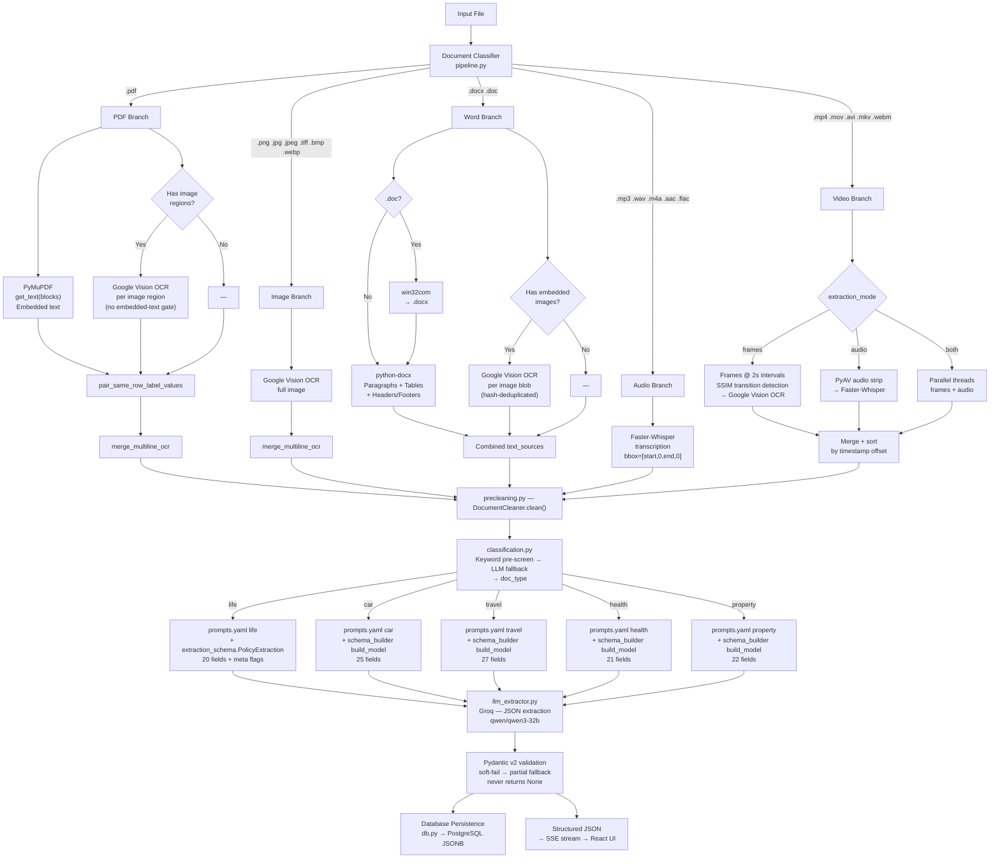

# Document Processor Pipeline & Cleaner

Modular pipeline that ingests PDF / Image / Word / Audio / Video files, extracts all text (embedded + OCR on images), cleans it, classifies the insurance type, and runs structured LLM extraction for 5 insurance document types.

---

## Architecture



---

## Insurance Types Supported

| Type | Fields | Required fields | Sample documents |
|------|--------|----------------|-----------------|
| `life` | 20 | `insurer_name`, `intermediary_name` | Personal Scheme V3, OMI-MULTISURE, Quicksure |
| `car` | 25 | none | Bajaj General two-wheeler package |
| `travel` | 27 | none | IRCTC / United India rail travel cert |
| `health` | 21 | none | Star Health Family Accident Care |
| `property` | 22 | none | RSR Brokers Multisure commercial binder |

---

## Key Design Decisions

### Classification — keyword pre-screen first

`classification.py` runs a regex keyword scan **before** any LLM call. Each type has a pattern list; travel/car/health/property need 2+ hits, life needs only 1 hit (handles fragmented video/image OCR). Falls back to LLM if no keyword match, then defaults to `"life"` on any failure.

```
keyword scan → LLM (if no match) → keyword scan again → "life"
```

### PDF Branch — OCR runs unconditionally

OCR runs on every detected image region regardless of embedded char count. Mixed PDFs (title + footer in embedded text, policy data in a raster image) were silently losing all policy data under the old `embedded_chars < 50` gate. Duplicates between embedded and OCR are eliminated in precleaning (IoU + text similarity), preferring embedded text.

### `pair_same_row_label_values` (PDF only)

Bare `:` label blocks and their values sit on the same Y but far apart in X — `merge_multiline_ocr` never joins them. This function runs first and attaches all same-row value tokens to their label: `"Cell: 9782793478"` instead of two disconnected fragments.

### Validation — soft-fail, never `None`

`validate_extraction()` never returns `None`. On `ValidationError`:
1. For `life`: patches empty required fields (`insurer_name`, `intermediary_name`) to `"Unknown"` and retries
2. Last resort: wraps raw LLM JSON in a `SimpleNamespace` with `.model_dump_json()` so `server.py` always gets a result

### `policy_status_defaulted` — deterministic

`validate_extraction()` regex-scans cleaned text for `Status:` / `Policy Status:` independently of the LLM. If no label found **and** LLM returned exactly `"Active"` (the prompt default), sets `_extraction_meta.policy_status_defaulted = True`.

### Prompts externalised to `prompts.yaml`

All system prompts and user prompt templates live in `prompts.yaml` keyed by `doc_type`. Edit prompts without touching Python. **Note:** YAML does not allow duplicate top-level keys — the `property:` block must appear exactly once.

### `fields.yaml` — single source for non-life schemas

`schema_builder.py` reads `fields.yaml` and calls `pydantic.create_model()` at runtime. Only `life` uses the hand-tuned `extraction_schema.PolicyExtraction`; all other types are built generically. Only `life` has `required: true` fields; all others soft-fail to `""`.

---

## File Map

### 1. Document Classification
Routes incoming files to the correct processor based on extension:
- `.pdf` -> PDF branch
- `.png`, `.jpg`, `.jpeg`, `.tiff`, `.bmp`, `.webp` -> Image branch
- `.docx` -> Word branch (parsed directly)
- `.doc` -> Word branch (converted to `.docx` first, Windows only)
- `.mp3`, `.wav`, `.m4a`, `.aac`, `.flac` -> Audio branch
- `.mp4`, `.mov`, `.avi`, `.mkv`, `.webm` -> Video branch

Any other extension raises a `ValueError`.

### 2. Document Extraction Branches

- **Image Branch**: Feeds the image directly to PaddleOCR, then runs the raw OCR lines through the **Layout-Aware Multiline OCR Merge** algorithm (`merge_multiline_ocr`), which groups multi-line address/wrapped-text blocks without merging unrelated parallel columns, headers, or distinct key-value lines. Merge candidacy is decided by vertical gap, horizontal alignment relative to a detected label column, label-vs-value casing consistency, and an "intervening label" check that blocks merging across an unrelated row in between.

- **PDF Branch**: Extracts native embedded text via PyMuPDF's `page.get_text("blocks")` first -- this text is **not** passed through `merge_multiline_ocr`, since it's already correctly segmented by PyMuPDF's own block detection. Targeted OCR runs only on detected image regions (scanned pages, logos, signatures) when embedded text on the page is below ~50 characters or `force_ocr=True`. Only those OCR results go through the multiline merge before being combined with the embedded text.

- **Word Branch (`.docx` / `.doc`)**: `.doc` files are converted to `.docx` via Microsoft Word COM automation (`pywin32`) -- Windows-only, requires Word installed. The `.docx` is parsed with `python-docx`, recursively traversing paragraphs and tables (including nested tables inside cells) in document order. Headers/footers from all section variants are extracted and deduplicated by XML element identity. All Word output uses a fixed simulated Letter-size coordinate space (`612 x 792` points), with every block's bbox set to `[0.0, 0.0, 0.0, 0.0]`, since Word has no native page-coordinate concept.

- **Video Branch**: Handles video processing with support for three modes: Extract Text from Video Frames (OCR), Extract Text from Audio, or Both (executed concurrently in parallel). Frame seeking runs at 2-second intervals. A custom SSIM (Structural Similarity Index) function calculates transition similarity between consecutive frames:
  - `SSIM < 0.85`: slide/frame content changed, triggers Google Vision OCR.
  - `SSIM > 0.90`: identical frame content, skips OCR entirely.
  - `0.85 <= SSIM <= 0.90`: fuzzy transition zone, runs OCR and compares extracted text against the previous kept frame using `RapidFuzz`. If similarity $> 95.0\%$, the results are discarded.
  Extracted audio and frame OCR sources are merged chronologically into a single page's text sources list.

### 3. In-Memory Precleaning (`precleaning.py`)

`DocumentCleaner.clean(result)` runs a six-stage cleaning pipeline over each page's `text_sources` and **replaces it in place** -- the output keeps the same field name and per-block schema (`source`, `text`, `bbox`, `confidence`); there is no separate `cleaned_text_sources` field and no raw/corrected pairing in the result. The cleaner ships with a built-in insurance-domain dictionary and OCR-misread correction map, and includes a guard against fuzzy-matching a correctly spelled word to an unrelated valid word that merely shares a prefix (e.g. blocking `"month"` -> `"Monthly"`). See `precleaning.py` for the full stage-by-stage breakdown.

### 4. LLM Extraction (`llm_extractor.py`)

Orchestrates the full pipeline end-to-end: raw extraction -> in-memory cleaning -> reconstructing cleaned text per page -> a single Groq chat-completion call. The prompt extracts **20 fixed insurance-policy fields** as a strict JSON object, explicitly instructed not to infer, guess, or correct OCR errors.

Two behaviors worth knowing about:

  * **Deterministic `policy_status_defaulted` detection**: `llm_extractor.py` checks the cleaned document text itself for an explicit `"Status:"` or `"Policy Status:"` label (`has_explicit_status_label`). If no such label is present **and** the LLM returned the prompt default (`"Active"`), the script marks `_extraction_meta.policy_status_defaulted = True` so the downstream validation explicitly records defaulting behavior.
- **Console logging**: `query_llm_openrouter()` prints the LLM call latency and token usage (`input`/`output`/`total`, from the OpenRouter response's `usage` field) after every extraction call; `process_document()` prints total end-to-end processing time. The raw extracted JSON and validated-extraction JSON are no longer dumped to the console -- only the final result is returned to the caller (e.g. `server.py`'s SSE stream).

API keys and model overrides are read from a hand-rolled `.env` parser (`load_env_file()`) -- not `python-dotenv`.

### 5. Validation Layer (Pydantic models)

Validation is performed by Pydantic v2 models. Models for all document types are constructed at runtime from `fields.yaml` via `schema_builder.build_model(doc_type)`. The `llm_extractor` code applies one additional life-specific step: `_LIFE_REMOVED_FIELDS = {"policy_type", "policy_status"}` strips those two fields from the raw LLM JSON before validation so they never appear in the stored JSON or UI.

Phone numbers, dates, premium amounts, and policy-number shapes are validated against the same format rules as the extraction prompt; date fields additionally get a real calendar check (`datetime.strptime`), so a shape-valid-but-impossible date like `31/02/2020` is caught and emptied, not just format-checked by regex. Most validation failures are **soft** -- coerced to `""` per the prompt's own "if invalid, return empty" instruction -- except `insurer_name` and `intermediary_name`, which are treated as required by the runtime validators for `life` (the code patches empty values to "Unknown" and retries once).

Note: older versions of the project included a hand-written `extraction_schema.py` for `life`. That file is not present in this workspace; its former behavior has been consolidated into the runtime builder/validators in `schema_builder.py` and the `llm_extractor` fallback logic.

### 6. Database Persistence Layer (`db.py`)

A PostgreSQL storage layer saves all document extraction results to a unified `processed_documents` table. It uses PostgreSQL's native `JSONB` format to store dynamic schema fields (for Life, Car, Travel, Health, and Property policies) in a single flexible database table.
* Connection pool management (`SimpleConnectionPool`) with automatic table and index creation on startup.
* GIN indexes for high-performance querying inside the `JSONB` columns.
* Persists results automatically whenever `process_document()` is run (via the FastAPI API server or the CLI).

| File | Role |
|------|------|
| `pipeline.py` | Document ingestion → `text_sources` list |
| `precleaning.py` | Six-stage in-memory cleaning of `text_sources` |
| `classification.py` | Keyword pre-screen + LLM → `doc_type` |
| `llm_extractor.py` | End-to-end orchestration → Groq → validate |
| `db.py` | PostgreSQL database connection, table initialization & persistence |
| (no separate file)     | `life` and other types: Pydantic models are built from `fields.yaml` at runtime via `schema_builder.py` |
| `schema_builder.py` | Builds Pydantic models from `fields.yaml` at runtime |
| `fields.yaml` | Field definitions for car / travel / health / property |
| `prompts.yaml` | LLM system prompt + user prompt template per `doc_type` |
| `server.py` | FastAPI wrapper — `POST /api/process` SSE stream |
| `App.jsx` | React UI — dynamic field groups per `doc_type` |
| `video_processor.py` | SSIM-gated frame extraction + audio transcription |

---

## Running

### Full pipeline + LLM extraction
```powershell
.\venv\Scripts\python.exe llm_extractor.py                          # interactive
.\venv\Scripts\python.exe llm_extractor.py data/policy.pdf          # CLI
.\venv\Scripts\python.exe llm_extractor.py data/policy.pdf --model qwen/qwen3-32b --api-key gsk_...
```

### Pipeline only (save raw JSON)
```powershell
.\venv\Scripts\python.exe pipeline.py data/policy.pdf --output-dir output
# --use-gpu              enable GPU for Whisper
# --extraction-mode      frames | audio | both  (video files only)
```

### Clean a saved pipeline JSON
```powershell
.\venv\Scripts\python.exe precleaning.py output/doc_policy_merged.json
# --drop-garbage    remove (not just pass through) signature/noise blocks
```

### API server
```powershell
.\venv\Scripts\python.exe server.py
# POST http://127.0.0.1:8000/api/process   multipart/form-data   field: file
```

---

## `.env`
```env
GROQ_API_KEY=gsk_...
GROQ_MODEL=qwen/qwen3-32b
GOOGLE_VISION_API_KEY=...

# PostgreSQL Database Configuration
DB_HOST=localhost
DB_PORT=5432
DB_NAME=insurance_db
DB_USER=postgres
DB_PASSWORD=your_password
```
Set `GROQ_MODEL` to the Groq model you want to use.

---

## Requirements

- `psycopg2-binary` — PostgreSQL database adapter
- `pywin32` — Windows only, `.doc → .docx` conversion
- `faster-whisper` + `torch` — audio/video branch only
- `av` (PyAV) — video audio extraction
- `opencv-python` — video frame extraction + SSIM
- `pydantic >= 2`, `requests`, `fastapi`, `uvicorn`
- `python-docx`, `pymupdf`, `google-cloud-vision`
- `ftfy`, `rapidfuzz`, `pyyaml`

### Validation — soft-fail, never `None`

`validate_extraction()` never returns `None`. On `ValidationError`:
1. For `life`: patches empty required fields (`insurer_name`, `intermediary_name`) to `"Unknown"` and retries
2. Last resort: wraps raw LLM JSON in a `SimpleNamespace` with `.model_dump_json()` so `server.py` always gets a result

### `policy_status_defaulted` — deterministic

`validate_extraction()` regex-scans cleaned text for `Status:` / `Policy Status:` independently of the LLM. If no label found **and** LLM returned exactly `"Active"` (the prompt default), sets `_extraction_meta.policy_status_defaulted = True`.

### Prompts externalised to `prompts.yaml`

All system prompts and user prompt templates live in `prompts.yaml` keyed by `doc_type`. Edit prompts without touching Python. **Note:** YAML does not allow duplicate top-level keys — the `property:` block must appear exactly once.

### `fields.yaml` — single source for non-life schemas

`schema_builder.py` reads `fields.yaml` and calls `pydantic.create_model()` at runtime. Only `life` uses the hand-tuned `extraction_schema.PolicyExtraction`; all other types are built generically. Only `life` has `required: true` fields; all others soft-fail to `""`.

---

## File Map

### 1. Document Classification
Routes incoming files to the correct processor based on extension:
- `.pdf` -> PDF branch
- `.png`, `.jpg`, `.jpeg`, `.tiff`, `.bmp`, `.webp` -> Image branch
- `.docx` -> Word branch (parsed directly)
- `.doc` -> Word branch (converted to `.docx` first, Windows only)
- `.mp3`, `.wav`, `.m4a`, `.aac`, `.flac` -> Audio branch
- `.mp4`, `.mov`, `.avi`, `.mkv`, `.webm` -> Video branch

Any other extension raises a `ValueError`.

### 2. Document Extraction Branches

- **Image Branch**: Feeds the image directly to PaddleOCR, then runs the raw OCR lines through the **Layout-Aware Multiline OCR Merge** algorithm (`merge_multiline_ocr`), which groups multi-line address/wrapped-text blocks without merging unrelated parallel columns, headers, or distinct key-value lines. Merge candidacy is decided by vertical gap, horizontal alignment relative to a detected label column, label-vs-value casing consistency, and an "intervening label" check that blocks merging across an unrelated row in between.

- **PDF Branch**: Extracts native embedded text via PyMuPDF's `page.get_text("blocks")` first -- this text is **not** passed through `merge_multiline_ocr`, since it's already correctly segmented by PyMuPDF's own block detection. Targeted OCR runs only on detected image regions (scanned pages, logos, signatures) when embedded text on the page is below ~50 characters or `force_ocr=True`. Only those OCR results go through the multiline merge before being combined with the embedded text.

- **Word Branch (`.docx` / `.doc`)**: `.doc` files are converted to `.docx` via Microsoft Word COM automation (`pywin32`) -- Windows-only, requires Word installed. The `.docx` is parsed with `python-docx`, recursively traversing paragraphs and tables (including nested tables inside cells) in document order. Headers/footers from all section variants are extracted and deduplicated by XML element identity. All Word output uses a fixed simulated Letter-size coordinate space (`612 x 792` points), with every block's bbox set to `[0.0, 0.0, 0.0, 0.0]`, since Word has no native page-coordinate concept.

- **Audio Branch**: Transcribes audio files using Faster-Whisper and maps timestamped segments into the universal `text_sources` schema.

  * **Workflow**:
    1. Audio decoding to 16kHz mono using `faster_whisper.audio.decode_audio()`.
    2. Transcription via `WhisperModel.transcribe()` (lazy-loaded `small` model).
    3. Each segment becomes a `source: audio` block with `metadata: {start_time, end_time}` and `bbox: [start_time, 0.0, end_time, 0.0]` for chronological merging.
    4. Returned blocks are sorted chronologically and passed through `precleaning.DocumentCleaner`.

  * **Why we map to `bbox`**: keeps the audio branch compatible with the rest of the pipeline (merging, deduplication, reading-order sorting) without special-case handling.

- **Video Branch**: Handles video processing with support for three modes: Extract Text from Video Frames (OCR), Extract Text from Audio, or Both (executed concurrently in parallel). Frame seeking runs at 2-second intervals. A custom SSIM (Structural Similarity Index) function calculates transition similarity between consecutive frames:
  - `SSIM < 0.85`: slide/frame content changed, triggers Google Vision OCR.
  - `SSIM > 0.90`: identical frame content, skips OCR entirely.
  - `0.85 <= SSIM <= 0.90`: fuzzy transition zone, runs OCR and compares extracted text against the previous kept frame using `RapidFuzz`. If similarity $> 95.0\%$, the results are discarded.
  Extracted audio and frame OCR sources are merged chronologically into a single page's text sources list.

### 3. In-Memory Precleaning (`precleaning.py`)

`DocumentCleaner.clean(result)` runs a six-stage cleaning pipeline over each page's `text_sources` and **replaces it in place** -- the output keeps the same field name and per-block schema (`source`, `text`, `bbox`, `confidence`); there is no separate `cleaned_text_sources` field and no raw/corrected pairing in the result. The cleaner ships with a built-in insurance-domain dictionary and OCR-misread correction map, and includes a guard against fuzzy-matching a correctly spelled word to an unrelated valid word that merely shares a prefix (e.g. blocking `"month"` -> `"Monthly"`). See `precleaning.py` for the full stage-by-stage breakdown.

### 4. LLM Extraction (`llm_extractor.py`)

Orchestrates the full pipeline end-to-end: raw extraction -> in-memory cleaning -> reconstructing cleaned text per page -> a single Groq chat-completion call. The prompt extracts **20 fixed insurance-policy fields** as a strict JSON object, explicitly instructed not to infer, guess, or correct OCR errors.

Two behaviors worth knowing about:

- **`policy_type` vs. contract frequency**: the prompt now explicitly distinguishes the product/plan name (`policy_type`, e.g. `"OMI - MULTISURE 2024.4"`) from a separate billing-frequency word (`"MONTHLY"`, `"ANNUAL"`) that can appear merged into the same OCR block. The frequency word is explicitly listed as a non-example for `policy_type`, since earlier extractions sometimes returned the frequency word instead of the product name when both were present in one merged block.
- **Deterministic `policy_status_defaulted` detection**: rather than asking the LLM to self-report whether `policy_status` was found or defaulted, `llm_extractor.py` independently checks the *cleaned document text itself* for an explicit `"Status:"` or `"Policy Status:"` label (`has_explicit_status_label`). If no such label exists in the text **and** the returned value matches the prompt's literal default (`"Active"`), the script sets `policy_status_defaulted=True` on the validation metadata itself -- this doesn't depend on the LLM noticing or reporting the absence, since the current prompt doesn't ask it to.
- **Console logging**: `query_llm_openrouter()` prints the LLM call latency and token usage (`input`/`output`/`total`, from the OpenRouter response's `usage` field) after every extraction call; `process_document()` prints total end-to-end processing time. The raw extracted JSON and validated-extraction JSON are no longer dumped to the console -- only the final result is returned to the caller (e.g. `server.py`'s SSE stream).

API keys and model overrides are read from a hand-rolled `.env` parser (`load_env_file()`) -- not `python-dotenv`.

### 5. Validation Layer (`extraction_schema.py`)

A Pydantic v2 model, `PolicyExtraction`, mirrors the 20-field LLM output plus a required `_extraction_meta` object carrying confidence/provenance flags the strict field schema can't express alone: `policy_status_defaulted`, `policy_status_unrecognized` (a real-but-unknown status word, kept rather than discarded), `email_missing_at_symbol` (a confirmed real OCR failure mode where `@` is dropped but the rest of the address stays readable), and `fields_not_found` / `fields_uncertain` lists.

Phone numbers, dates, premium amounts, and policy-number shapes are validated against the same format rules as the extraction prompt; date fields additionally get a real calendar check (`datetime.strptime`), so a shape-valid-but-impossible date like `31/02/2020` is caught and emptied, not just format-checked by regex. Most validation failures are **soft** -- coerced to `""` per the prompt's own "if invalid, return empty" instruction -- except `insurer_name` and `intermediary_name`, which are required (`min_length=1`).

**Current integration status**: `llm_extractor.py` now imports `PolicyExtraction` and calls `validate_extraction(parsed_json, document_text=document_text)` immediately after parsing the LLM's raw JSON. Since the LLM itself still doesn't emit `_extraction_meta` (the prompt doesn't ask it to), `validate_extraction` fills in a conservative default meta object when it's missing, then layers on the one deterministic check described above (`policy_status_defaulted`) before handing everything to `PolicyExtraction.model_validate(...)`. The other meta flags (`policy_status_unrecognized`, `email_missing_at_symbol`, `fields_not_found`, `fields_uncertain`) still rely entirely on `PolicyExtraction`'s own field/model validators -- they are not yet independently cross-checked against the source text the way `policy_status_defaulted` now is.

### 6. Database Persistence Layer (`db.py`)

A PostgreSQL storage layer saves all document extraction results to a unified `processed_documents` table. It uses PostgreSQL's native `JSONB` format to store dynamic schema fields (for Life, Car, Travel, Health, and Property policies) in a single flexible database table.
* Connection pool management (`SimpleConnectionPool`) with automatic table and index creation on startup.
* GIN indexes for high-performance querying inside the `JSONB` columns.
* Persists results automatically whenever `process_document()` is run (via the FastAPI API server or the CLI).

| File | Role |
|------|------|
| `pipeline.py` | Document ingestion → `text_sources` list |
| `precleaning.py` | Six-stage in-memory cleaning of `text_sources` |
| `classification.py` | Keyword pre-screen + LLM → `doc_type` |
| `llm_extractor.py` | End-to-end orchestration → Groq → validate |
| `db.py` | PostgreSQL database connection, table initialization & persistence |
| `extraction_schema.py` | Pydantic v2 model — life 20 fields + meta flags |
| `schema_builder.py` | Builds Pydantic models from `fields.yaml` at runtime |
| `fields.yaml` | Field definitions for car / travel / health / property |
| `prompts.yaml` | LLM system prompt + user prompt template per `doc_type` |
| `server.py` | FastAPI wrapper — `POST /api/process` SSE stream |
| `App.jsx` | React UI — dynamic field groups per `doc_type` |
| `video_processor.py` | SSIM-gated frame extraction + audio transcription |

---

## Running

### Full pipeline + LLM extraction
```powershell
.\venv\Scripts\python.exe llm_extractor.py                          # interactive
.\venv\Scripts\python.exe llm_extractor.py data/policy.pdf          # CLI
.\venv\Scripts\python.exe llm_extractor.py data/policy.pdf --model qwen/qwen3-32b --api-key gsk_...
```

### Pipeline only (save raw JSON)
```powershell
.\venv\Scripts\python.exe pipeline.py data/policy.pdf --output-dir output
# --use-gpu              enable GPU for Whisper
# --extraction-mode      frames | audio | both  (video files only)
```

### Clean a saved pipeline JSON
```powershell
.\venv\Scripts\python.exe precleaning.py output/doc_policy_merged.json
# --drop-garbage    remove (not just pass through) signature/noise blocks
```

### API server
```powershell
.\venv\Scripts\python.exe server.py
# POST http://127.0.0.1:8000/api/process   multipart/form-data   field: file
```

---

## `.env`
```env
GROQ_API_KEY=gsk_...
GROQ_MODEL=qwen/qwen3-32b
GOOGLE_VISION_API_KEY=...

# PostgreSQL Database Configuration
DB_HOST=localhost
DB_PORT=5432
DB_NAME=insurance_db
DB_USER=postgres
DB_PASSWORD=your_password
```
Set `GROQ_MODEL` to the Groq model you want to use.

---

## Requirements

- `psycopg2-binary` — PostgreSQL database adapter
- `pywin32` — Windows only, `.doc → .docx` conversion
- `faster-whisper` + `torch` — audio/video branch only
- `av` (PyAV) — video audio extraction
- `opencv-python` — video frame extraction + SSIM
- `pydantic >= 2`, `requests`, `fastapi`, `uvicorn`
- `python-docx`, `pymupdf`, `google-cloud-vision`
- `ftfy`, `rapidfuzz`, `pyyaml`

