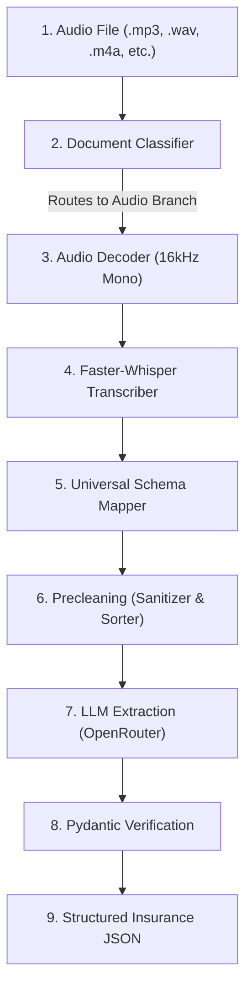

# Audio Extraction Guide: How Speech-to-Text Works in the Pipeline

This guide explains in simple words how the audio processing and transcription system works in the Insurance Document Processor. It covers the model used, parameters, installation, and the step-by-step journey of an audio file through the pipeline.

---

## 1. The Speech-to-Text Model We Use

We use **Faster-Whisper** (specifically the **`small`** variant) as our speech-to-text engine.

### What is Faster-Whisper?
* **Whisper** is a state-of-the-art voice recognition model created by OpenAI. It can transcribe spoken audio into written text in many languages.
* **Faster-Whisper** is a highly optimized re-implementation of OpenAI's model using an engine called **CTranslate2**. 
* **Why we use it**: It is up to **4 times faster** than the original Whisper model and uses **much less computer memory (RAM)**, allowing it to run smoothly on standard computers without needing expensive hardware.
* **Why not use a cloud STT service?** We chose local transcription to keep the pipeline self-contained, reduce dependency on external APIs for raw audio transcription, and lower recurring usage costs.
* **Why not use another local model?** The `small` variant offers a practical balance: higher accuracy than tiny models, lower resource cost than medium/large models, and more predictable latency than oversized alternatives.

---

## 2. Installation and Setup

To run audio transcription, the system needs `faster-whisper` and its supporting libraries.

### A. Automatic Installation
All backend requirements are packaged in [requirements.txt](file:///d:/ppoc/requirements.txt). When you set up the backend environment, running this command installs the model dependencies:
```powershell
.\venv\Scripts/pip install -r requirements.txt
```

### B. Hardware Acceleration (Optional)
Faster-Whisper runs automatically on your computer's **CPU**. However, if your computer has a dedicated NVIDIA graphics card (GPU) with CUDA support:
* It will automatically load the model onto the **GPU**.
* GPU transcription is significantly faster (often processing audio in a fraction of its actual duration).

---

## 3. Model Parameters and Configurations

Under the hood, in [pipeline.py](file:///d:/ppoc/backend/pipeline.py), the model is configured with the following settings:

1. **Model Size (`"small"`)**:
   We choose the `"small"` variant of Whisper (contains ~244 million parameters). This strikes the perfect balance between **transcription accuracy** and **processing speed** on consumer hardware.
2. **Device Routing**:
   * **If GPU is available**: Loads model using `device="cuda"` with `compute_type="float16"` (high precision, high speed).
   * **If CPU only**: Loads model using `device="cpu"` with `compute_type="int8"` (quantized memory compression, which uses 8-bit integers to shrink memory requirements without losing much accuracy).
3. **Lazy Loading**:
   To save memory, the model is **lazy-loaded**. It will *not* load into memory when the server starts up; instead, it waits until you upload your first audio file, loads once, and stays in memory for subsequent uploads.

### Why this design?
* **Model size matters**: `small` is fast enough for accurate transcription, while still being lightweight enough for consumer hardware.
* **GPU vs CPU**: We prefer GPU when available because it speeds transcription dramatically, but we avoid requiring it so the pipeline still runs on regular laptops.
* **Lazy load**: Keeps server startup fast and avoids reserving RAM for audio until needed.
* **Faster-Whisper vs original Whisper**: The optimized implementation gives us the same transcription quality with lower latency and smaller memory footprint.

---

## 4. The Audio Pipeline (Step-by-Step Flow)

Here is the exact journey of an audio file from start to finish:



### Step 1: Uploading the Audio File
You select your audio recording from the user interface, via a direct API request, or by running the script locally in your terminal.
* **Files Involved**:
  * **Frontend**: [App.jsx](file:///d:/ppoc/frontend/src/App.jsx) (handles file selection, extension validation, and triggers the `fetch` upload request).
  * **Backend**: [server.py](file:///d:/ppoc/backend/server.py) (exposes the `/api/process` endpoint, writes the uploaded file to a temporary `uploads/` directory, and passes it to the extraction process).

### Step 2: Document Classification
The classifier checks the file extension of the uploaded file to decide how it should be processed.
* **Files Involved**:
  * **Backend**: [pipeline.py](file:///d:/ppoc/backend/pipeline.py) (uses the `classify_document()` method inside the `DocumentProcessorPipeline` class to route audio formats (`.mp3`, `.wav`, `.m4a`, `.aac`, `.flac`) to the `"audio"` branch).

### Step 3: Audio Decoding & Preprocessing
Whisper requires standardized audio data to operate at peak accuracy. The system decodes and standardizes the audio stream.
* **Files Involved**:
  * **Backend**: [pipeline.py](file:///d:/ppoc/backend/pipeline.py) (within `process_audio()`, imports and runs `faster_whisper.audio.decode_audio` to convert the input file into a standardized **16kHz mono** audio format).

### Why 16kHz Mono?
* Faster-Whisper and the underlying Whisper architecture are tuned for 16kHz audio.
* Mono audio removes channel redundancy and keeps transcription deterministic.
* Converting to 16kHz reduces compute and memory while preserving speech clarity.
* Standardized audio means the model is not surprised by varying sample rates or stereo layouts.

### Step 4: Faster-Whisper Transcription
The standardized sound waves are fed into the speech-to-text model. The model listens to the audio stream and translates speech into textual segments with corresponding start and end timestamps.
* **Files Involved**:
  * **Backend**: [pipeline.py](file:///d:/ppoc/backend/pipeline.py) (calls `self.whisper.transcribe(audio_data)` using the lazy-loaded `WhisperModel`).

### Step 5: Mapping to the Universal Schema
To keep the audio data compatible with our layout-aware document models, transcription segments are mapped into the universal data structure.
* **Files Involved**:
  * **Backend**: [pipeline.py](file:///d:/ppoc/backend/pipeline.py) (within `process_audio()`, builds segments dictionary including the text, confidence score, timestamps in `metadata` (`start_time`/`end_time`), and maps time intervals to `bbox` space as `[start_time, 0.0, end_time, 0.0]`).

### Why map timestamps into `bbox`?
* The rest of the pipeline expects a unified `text_sources` shape (`text`, `bbox`, `confidence`, `metadata`).
* Using `bbox` for audio allows audio segments to be sorted and merged with other branches by the same logic.
* It keeps the audio branch compatible with `DocumentCleaner` and downstream readers without a special branch for audio-only data.
* The `metadata` field still preserves the real timing details.

### Step 6: In-Memory Precleaning (Detailed)
The raw transcript is processed through a strict **six-stage precleaning pipeline** to remove background noise, visual formatting artifacts, spelling mistakes, and text duplicates.
* **Why this matters for audio**:
  * Audio text is often less structured than printed documents, so the cleaner helps normalize and stabilize the transcription.
  * It removes repeated filler words, transcription noise, and low-confidence fragments before passing to the LLM.
* **Files Involved**:
  * **Backend**: [precleaning.py](file:///d:/ppoc/backend/precleaning.py) (defines the `DocumentCleaner` class and its cleaning algorithms) and [llm_extractor.py](file:///d:/ppoc/backend/llm_extractor.py) (instantiates and runs the cleaner).

#### 🔍 The 6 Precleaning Stages:
1. **Confidence Tiering**: Grades transcription segments into "high", "medium", or "low" tiers based on confidence scores. This allows downstream stages to prioritize high-trust transcriptions over low-trust guesses.
2. **Garbage & Scrawl Detection**: Identifies and filters out noise (e.g. stray dots/lines) or signature/scribble patterns. It checks for disproportionately tall blocks of low confidence or single symbols and removes them.
3. **Text Normalization**: 
   * Runs the `ftfy` library to fix character encoding errors and Mojibake (corrupted characters).
   * Normalizes whitespaces (collapsing double spaces/tabs).
   * Strips out structural visual noise (like random bullets or repeated trailing punctuation).
   * **Fuzzy Typo-Correction**: Compares words against a custom insurance domain dictionary (using `RapidFuzz` string similarity). For example, if OCR/Whisper misreads a word like `"Mutral"`, the cleaner snaps it back to `"Mutual"`.
4. **Date Normalization**: Locates calendar dates and unifies different separators (e.g. dots, hyphens) into standardized slashes (e.g., `01-12-2024` or `01.12.2024` are standardized to `01/12/2024`).
5. **Deduplication**: Resolves duplicate readings by checking the spatial overlap (Intersection-over-Union, IoU > 0.5) and text similarity (RapidFuzz score > 80). If the same text block is read twice, the cleaner discards the lower-confidence copy.
6. **Reading Order Sorting (Chronological for Audio)**: Sorts all text blocks top-to-bottom and left-to-right. For audio documents, because the y-coordinates in the bounding boxes are all set to `0.0` and the x-coordinates represent timestamps, this sorts the transcript blocks in perfect chronological order of when they were spoken.

### Step 7: LLM Structured Extraction
The sorted, cleaned text segments are combined into a single, clean text stream. This text stream is wrapped in a prompt template and sent to the LLM (Google Gemma-4 via the OpenRouter API) to parse out the 20 insurance fields.
* **Files Involved**:
  * **Backend**: [llm_extractor.py](file:///d:/ppoc/backend/llm_extractor.py) (orchestrates the prompt packaging, sets the API parameters, handles the free-tier `429` retry fallback, and calls the API).
  * **Configuration**: [prompts.yaml](file:///d:/ppoc/backend/prompts.yaml) (contains the exact `system_prompt` and `user_prompt_template` guidelines given to the model).

### Step 8: Pydantic Validation & Output
The JSON object returned by the LLM is validated against the database schema requirements to format numbers, clean dates, check values, and generate extraction reliability metadata.
* **Files Involved**:
  * **Backend**: [extraction_schema.py](file:///d:/ppoc/backend/extraction_schema.py) (defines the Pydantic v2 `PolicyExtraction` models, formatting constraints, date calendar checks, and metadata logic).
  * **Backend**: [llm_extractor.py](file:///d:/ppoc/backend/llm_extractor.py) (calls validation at `validate_extraction()`).

---

## 5. How to Run the Pipeline

### Option A: The Web Interface
1. Run `python backend/server.py` in your terminal.
2. In another terminal, go to the `frontend` folder and run `npm run dev`.
3. Open `http://localhost:5173` in your browser.
4. Drag and drop your audio file and click **Start Intelligent Processing**.

### Option B: The Terminal (CLI)
To run the full end-to-end flow and output the final validated JSON in your terminal:
```powershell
.\venv\Scripts/python backend/llm_extractor.py "path/to/your/audio.wav"
```
