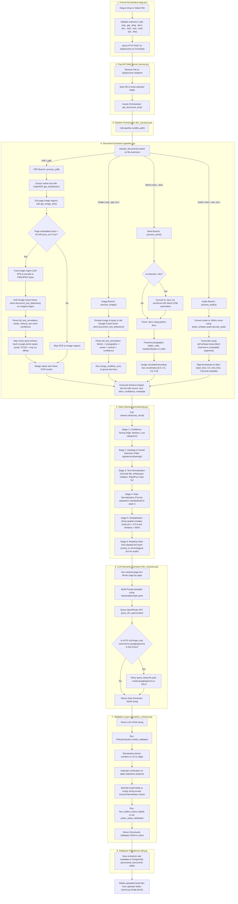

```mermaid
flowchart TD
    subgraph UI ["1. Front-End Interface (App.jsx)"]
        A["Drag & Drop or Select File"] --> B["Validate extension (.pdf, .png, .jpg, .jpeg, .docx, .doc, .mp3, .wav, .m4a, .aac, .flac)"]
        B --> C["Send HTTP POST to /api/process as FormData"]
    end

    subgraph API ["2. Fast API Web Server (server.py)"]
        C --> D["Receive File at /api/process endpoint"]
        D --> E["Save file to temp uploads/ folder"]
        E --> F["Invoke Orchestrator: get_document_text()"]
    end

    subgraph Orchestrator ["3. Pipeline Orchestrator (llm_extractor.py)"]
        F --> G["Call pipeline.run(file_path)"]
    end

    subgraph Pipeline ["4. Document Extraction (pipeline.py)"]
        G --> H["classify_document() based on file extension"]

        H -->|"PDF (.pdf)"| I["PDF Branch: process_pdf()"]
        H -->|"Image (.png, .jpg, etc.)"| J["Image Branch: process_image()"]
        H -->|"Word (.docx, .doc)"| K["Word Branch: process_word()"]
        H -->|"Audio (.mp3, .wav, etc.)"| L["Audio Branch: process_audio()"]

        I --> I1["Extract native text with PyMuPDF get_text('blocks')"]
        I1 --> I2["Get page image regions with get_image_info()"]
        I2 --> I3{"Page embedded chars < 50 OR force_ocr=True?"}
        I3 -->|"Yes"| I4["Crop image region (150 DPI) & encode to PNG/JPEG bytes"]
        I4 --> I5["Call Google Cloud Vision client.document_text_detection() on cropped region"]
        I5 --> I5a["Parse full_text_annotation: words, vertices, per-word confidence"]
        I5a --> I6["Map Vision pixel vertices back to page points space (scale 72/150 + crop x/y offset)"]
        I3 -->|"No"| I7["Skip OCR on image regions"]
        I6 --> I8["Merge native and Vision OCR results"]
        I7 --> I8

        J --> J1["Encode image to bytes & call Google Cloud Vision client.document_text_detection()"]
        J1 --> J1a["Parse full_text_annotation: blocks -> paragraphs -> words + vertices + confidence"]
        J1a --> J2["Run merge_multiline_ocr() to group text lines"]

        K --> K1{"Is extension .doc?"}
        K1 -->|"Yes"| K2["Convert to .docx via win32com MS Word COM automation"]
        K1 -->|"No"| K3["Parse .docx using python-docx"]
        K2 --> K3
        K3 --> K4["Traverse paragraphs, tables, cells, headers/footers in order"]
        K4 --> K5["Assign simulated bounding box coordinates [0.0, 0.0, 0.0, 0.0]"]

        L --> L1["Convert audio to 16kHz mono using faster_whisper.audio.decode_audio"]
        L1 --> L2["Transcribe using self.whisper.transcribe() (Gemma-4 compatible segments)"]
        L2 --> L3["Map timestamps to bbox [start_time, 0.0, end_time, 0.0] and metadata"]

        I8 --> M["Universal Schema Output: dict list with source, text, bbox, confidence, metadata"]
        J2 --> M
        K5 --> M
        L3 --> M
    end

    subgraph Precleaning ["5. Data Cleaning (precleaning.py)"]
        M --> N["Call cleaner.clean(raw_result)"]
        N --> N1["Stage 1: Confidence Tiering (High, Medium, Low categories)"]
        N1 --> N2["Stage 2: Garbage & Scrawl Detection (Filter signatures/drawings)"]
        N2 --> N3["Stage 3: Text Normalization (Unicode ftfy, whitespace collapse, RapidFuzz typo fix)"]
        N3 --> N4["Stage 4: Date Normalization (Format separators standardized to slash /)"]
        N4 --> N5["Stage 5: Deduplication (Drop spatial overlaps using IoU > 0.5 & text similarity > 80%)"]
        N5 --> N6["Stage 6: Reading Order Sort (Spatial line band sorting, or chronological sort for audio)"]
    end

    subgraph LLM ["6. LLM Semantic Extraction (llm_extractor.py)"]
        N6 --> O["Join cleaned page text blocks page by page"]
        O --> P["Build Prompt template using backend/prompts.yaml"]
        P --> Q["Query OpenRouter API: query_llm_openrouter()"]
        Q --> Q1{"Is HTTP 429 Rate Limit returned for google/gemma-4-31b-it:free?"}
        Q1 -->|"Yes"| Q2["Retry query using the paid model google/gemma-4-31b-it"]
        Q1 -->|"No"| R["Return Raw Extraction JSON string"]
        Q2 --> R
    end

    subgraph Validation ["7. Validation Layer (extraction_schema.py)"]
        R --> S["Parse LLM JSON string"]
        S --> T["Run PolicyExtraction.model_validate()"]
        T --> T1["Standardize phone numbers to 10-11 digits"]
        T1 --> T2["Calendar verification on dates (datetime.strptime)"]
        T2 --> T3["Soft-fail invalid fields to empty string except insurer/intermediary names"]
        T3 --> T4["Run has_explicit_status_label() to set policy_status_defaulted"]
        T4 --> U["Return Structured, Validated JSON to client"]
    end

    subgraph Database ["8. Database Persistence (db.py)"]
        U --> W["Save extraction and metadata to PostgreSQL (processed_documents table)"]
    end

    W --> V["Delete uploaded temp files from uploads/ folder (server.py finally block)"]
```
