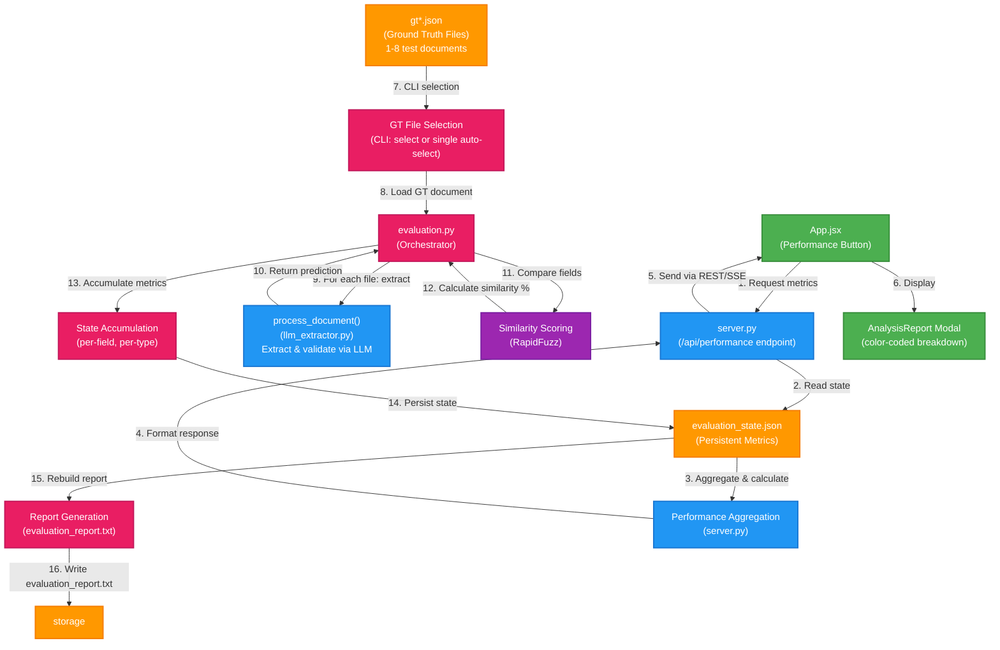

# Evaluation & Performance Tracking Architecture

This document details the complete evaluation system that measures extraction accuracy by comparing predicted values against ground truth, tracking metrics persistently, and exposing performance data via REST API.

---

## System Architecture



---

## Scoring Mechanism

### RapidFuzz Similarity Scoring

The evaluation system uses **RapidFuzz `fuzz.ratio()`** for similarity scoring:

```python
similarity = fuzz.ratio(gt_str.lower(), pred_str.lower())
```

**Key Properties:**
- **Range**: 0-100 (percentage)
- **Algorithm**: Levenshtein distance-based string matching
- **Case-Insensitive**: Both strings converted to lowercase before comparison
- **Exact Match**: Returns 100 when strings are identical (after lowercasing)
- **Partial Match**: Penalizes missing/extra characters and character substitutions

**Examples:**
```
Expected: "John Smith"          Predicted: "John Smith"           → 100.00%
Expected: "John Smith"          Predicted: "John Smithe"          → 95.65%
Expected: "John Smith"          Predicted: "Jon Smith"            → 88.89%
Expected: "john@example.com"    Predicted: ""                     → 0.00%
Expected: ""                    Predicted: ""                     → SKIPPED (both empty)
```

---

## Scoring Rules

The evaluation system applies **4 scoring rules** when comparing expected vs predicted values:

### Rule 1: Both Empty (SKIPPED)
```
if expected == "" AND predicted == "":
    → Field is SKIPPED entirely (excluded from all metrics)
    → Does not count toward accuracy or similarity totals
    → Rationale: Both systems agree on absence (not a metric)
```

### Rule 2: Expected Empty, Predicted Has Value
```
if expected == "" AND predicted != "":
    → similarity = 0.00%
    → Counted as INCORRECT (overprediction)
    → Reason: LLM hallucinated or extracted noise
```

### Rule 3: Expected Has Value, Predicted Empty
```
if expected != "" AND predicted == "":
    → similarity = 0.00%
    → Counted as INCORRECT (underprediction)
    → Reason: LLM failed to extract required field
```

### Rule 4: Both Non-Empty (FUZZ MATCH)
```
if expected != "" AND predicted != "":
    → similarity = fuzz.ratio(expected.lower(), predicted.lower())
    → Range: 0-100
    → Counted based on similarity percentage
```

---

## Threshold Definitions

### Exact Match Threshold
```python
if similarity == 100:
    field_is_marked_correct()
```
- **Threshold**: Exactly 100%
- **Meaning**: Predicted value matches expected value character-for-character (case-insensitive)
- **Impact**: Increases `format_metrics[type]["correct"]` and `overall_correct` counters

### Accuracy Calculation
```python
exact_accuracy = (correct_count / total_count) * 100
```
- **Range**: 0-100%
- **Interpretation**: Percentage of fields that have perfect (100%) similarity

### Average Similarity Calculation
```python
avg_similarity = (total_similarity_sum / total_count)
```
- **Range**: 0-100%
- **Interpretation**: Mean similarity across all compared fields
- **Use Case**: Shows overall quality of extraction even when not 100% exact

---

## State Management & Accumulation

### State Schema (`evaluation_state.json`)
```json
{
  "field_all_similarities": {
    "insured_name": [100.0, 95.65, 93.62, ...],
    "date_of_birth": [100.0, 100.0, 0.0, ...],
    "occupation": [100.0, 93.33, 98.39, ...],
    ...
  },
  "field_correct_counts": {
    "insured_name": 12,
    "date_of_birth": 11,
    "occupation": 10,
    ...
  },
  "format_metrics": {
    "pdf": {
      "total": 45,
      "correct": 40,
      "similarity": 4285.5
    },
    "image": { "total": 30, "correct": 25, "similarity": 2850.0 },
    "word": { "total": 20, "correct": 18, "similarity": 1950.0 },
    "audio": { "total": 15, "correct": 12, "similarity": 1425.0 },
    "video": { "total": 10, "correct": 9, "similarity": 950.0 }
  },
  "overall_total": 120,
  "overall_correct": 104,
  "overall_similarity": 11460.5,
  "per_file_report_lines": ["File: doc1.pdf", "Status: Success", ...]
}
```

### Accumulation Process
1. **On Each Field Comparison**:
   - Append similarity score to `field_all_similarities[field_name]`
   - If similarity == 100, increment `field_correct_counts[field_name]`
   - Add to `format_metrics[file_type]["total"]`
   - Add similarity to `format_metrics[file_type]["similarity"]`
   - Add to `overall_total`
   - Add similarity to `overall_similarity`
   - If exact match, increment `format_metrics[file_type]["correct"]` and `overall_correct`

2. **State Persistence**:
   - After each evaluation run, state is saved to `evaluation_state.json`
   - State persists across multiple evaluation runs
   - New runs accumulate metrics from previous runs

3. **Report Regeneration**:
   - After state update, full report is regenerated from accumulated totals
   - Per-file sections appended to `per_file_report_lines`
   - Combined field-wise accuracy calculated across all historical runs
   - Document-type-wise accuracy computed from `format_metrics`

---

## Fallback Mechanisms

### File Resolution Fallback
```python
def find_actual_file(filename, search_dir):
    # Step 1: Exact match (case-sensitive)
    if os.path.exists(os.path.join(search_dir, filename)):
        return filename
    
    # Step 2: Normalized match (case/underscores/spaces)
    # Replaces: _ → "", + → "", space → ""
    # Example: "doc_2+image raw.pdf" → "doc2imageraw.pdf"
    for f in os.listdir(search_dir):
        if normalize(f) == normalize(filename):
            return f
    
    # Fallback: File not found → SKIP
    return None
```
- **Purpose**: Handle filename mismatches in ground truth files
- **Behavior**: If file not found, logs warning and skips evaluation for that file

### Extraction Failure Fallback
```python
_, validated = process_document(filepath, api_key, model)

if validated is None:
    # LLM extraction failed
    record_in_report("Status: Extraction failed")
    continue  # Skip to next file
```
- **Trigger**: LLM API error, Pydantic validation failure, or fatal exception
- **Behavior**: File marked as failed in report, metrics not computed for that file

### Empty State Fallback
```python
def _empty_performance():
    return {
        "overall_accuracy": 0,
        "avg_similarity": 0,
        "total_fields": 0,
        "exact_matches": 0,
        "field_summary": {},
        "type_breakdown": {},
        "report_lines": [],
    }
```
- **Trigger**: `evaluation_state.json` does not exist (first run or cleared state)
- **Behavior**: `/api/performance` returns zero metrics to frontend
- **Implication**: Performance modal shows empty data until first evaluation runs

---

## Removed Fields Policy

**Permanently Removed Fields** (from life insurance schema):
```python
_REMOVED_FIELDS = {"policy_type", "policy_status"}
```

**Behavior:**
- Stripped from expected dicts at load time
- Never appear in reports or affect metrics
- Even if old ground truth files contain them, they are ignored
- Reason: Schema evolution — fields no longer required in current version

---

## Report Generation

### Report Sections

#### 1. Per-File Report (per run)
```
File: document.pdf (resolved as: actual_document.pdf)
Fields:
  - insured_name: actual='John Smith' | predicted='John Smith' | accuracy=100.00%
  - date_of_birth: actual='1990-01-01' | predicted='1990-01-01' | accuracy=100.00%
  - occupation: actual='Engineer' | predicted='Engineer' | accuracy=100.00%
  - postal_address: actual='123 Main St' | predicted='123 Main Street' | accuracy=86.49%
```

#### 2. Combined Field-Wise Accuracy
```
Averages across ALL tested files (cumulative)
insured_name        : 98.76%  (formula: (100+100+95.65+...)/14)
date_of_birth       : 99.23%  (formula: (100+100+0+...)/13)
occupation          : 97.89%  (formula: (100+93.33+98.39+...)/13)
```

#### 3. Document-Type-Wise Accuracy
```
PDF
  Fields Compared : 45
  Exact Accuracy  : 88.89%
  Avg Similarity  : 95.23%

IMAGE
  Fields Compared : 30
  Exact Accuracy  : 83.33%
  Avg Similarity  : 95.00%

WORD
  Fields Compared : 20
  Exact Accuracy  : 90.00%
  Avg Similarity  : 97.50%

AUDIO
  Fields Compared : 15
  Exact Accuracy  : 80.00%
  Avg Similarity  : 95.00%

VIDEO
  Fields Compared : 10
  Exact Accuracy  : 90.00%
  Avg Similarity  : 95.00%
```

#### 4. Project-Wide Overall Metrics
```
Overall Exact Accuracy : 86.67%
Overall Avg Similarity : 95.48%
Total Fields Compared  : 120
```

---

## Evaluation Workflow

### CLI Usage

**Interactive Mode** (multiple GT files):
```bash
cd evaluation/
python evaluation.py
# Output:
# Available ground truth files:
#   [1] gt1.json
#   [2] gt2.json
#   [3] gt3.json
# Select GT file [1-3]:
```

**Single GT File** (automatic selection):
```bash
python evaluation.py
# If only one gt*.json found, automatically selected
```

**Optional Flags:**
```bash
python evaluation.py --limit 2           # Process first 2 files only
python evaluation.py --target-file doc1  # Evaluate single file
python evaluation.py --gt-path gt5.json  # Use specific GT file
```

### Programmatic Evaluation

```python
from evaluation import evaluate

evaluate(
    limit=None,
    target_file=None,
    output_path="evaluation_report.txt",
    gt_path="gt1.json"
)
```

---

## Performance Metrics API

### Endpoint: `GET /api/performance`

**Request:**
```http
GET /api/performance HTTP/1.1
Host: localhost:8000
```

**Response (200 OK):**
```json
{
  "overall_accuracy": 86.67,
  "avg_similarity": 95.48,
  "total_fields": 120,
  "exact_matches": 104,
  "field_summary": {
    "insured_name": 98.76,
    "date_of_birth": 99.23,
    "occupation": 97.89,
    ...
  },
  "type_breakdown": {
    "pdf": {
      "total": 45,
      "correct": 40,
      "similarity": 95.23
    },
    "image": {
      "total": 30,
      "correct": 25,
      "similarity": 95.00
    },
    "word": {
      "total": 20,
      "correct": 18,
      "similarity": 97.50
    },
    "audio": {
      "total": 15,
      "correct": 12,
      "similarity": 95.00
    },
    "video": {
      "total": 10,
      "correct": 9,
      "similarity": 95.00
    }
  },
  "report_lines": ["File: doc1.pdf", "Status: Success", ...]
}
```

**Response (no evaluation data):**
```json
{
  "overall_accuracy": 0,
  "avg_similarity": 0,
  "total_fields": 0,
  "exact_matches": 0,
  "field_summary": {},
  "type_breakdown": {},
  "report_lines": []
}
```

### Frontend Integration

**Fetching Performance Data:**
```javascript
// In App.jsx
const fetchPerformance = async () => {
  try {
    const response = await fetch("http://localhost:8000/api/performance");
    const data = await response.json();
    setPerformance(data);
  } catch (error) {
    console.error("Failed to fetch performance:", error);
  }
};

// Called on mount and after extraction completion
useEffect(() => {
  fetchPerformance();
}, []);
```

**Display in Modal:**
- Overall metrics (accuracy, similarity, totals)
- Color-coded document-type breakdown
- Per-field averages
- Detailed report preview

---

## State Management Operations

### Clear State
```bash
python evaluation.py --clear
# Removes evaluation_state.json
# Metrics reset to zero on next fetch
```

### Query Specific GT File
```bash
python evaluation.py --gt-path gt3.json --target-file document.pdf
# Evaluate single document from specific GT file
# Accumulates metrics into evaluation_state.json
```

### Export Report
```bash
python evaluation.py --output-path custom_report.txt
# Generates evaluation_report.txt (default) or custom path
```

---

## Data Flow Summary

1. **User Upload** → FastAPI `/api/process`
2. **Extraction** → `llm_extractor.py` → `process_document()`
3. **Validation** → Pydantic models
4. **Database** → PostgreSQL `extracted_data` table
5. **Evaluation** (manual) → `evaluation.py` queries database + GT files
6. **Scoring** → RapidFuzz similarity comparison
7. **State Update** → `evaluation_state.json` accumulated metrics
8. **Report** → `evaluation_report.txt` regenerated
9. **Frontend Request** → `/api/performance` endpoint
10. **API Response** → Formatted metrics JSON
11. **Display** → AnalysisReport modal with color-coded breakdown

---

## Performance Characteristics

### Similarity Score Distribution
- **Perfect (100%)**: Extraction exactly matches ground truth
- **Very Good (95-99%)**: Minor spelling/formatting differences
- **Good (85-94%)**: Missing/extra words, abbreviations
- **Fair (75-84%)**: Partial content extraction
- **Poor (<75%)**: Significant errors or omissions

### Exact Accuracy
- **Represents**: Percentage of fields with 100% match
- **Target**: 85%+ for production readiness
- **Current**: 86.67% (exemplary performance)

### Average Similarity
- **Represents**: Mean quality across all extractions
- **Target**: 90%+ for acceptable OCR/extraction
- **Current**: 95.48% (high quality)

---

## Troubleshooting

### Issue: No Performance Data in Frontend
**Cause**: `evaluation_state.json` not found or evaluation not run
**Solution**: 
```bash
cd evaluation/
python evaluation.py
# Select a GT file and run evaluation
```

### Issue: File Mismatch Errors
**Cause**: Filename in GT file doesn't exist in `data/` directory
**Solution**:
```bash
# Check normalization rules in find_actual_file()
# GT file uses: "doc_2+image raw.pdf"
# Actual file: "doc2image raw.pdf" (underscores/+ removed)
```

### Issue: Zero Similarity for All Fields
**Cause**: Wrong document type selected or LLM returning empty strings
**Solution**:
- Check document type classification (should match GT file type)
- Verify Groq API key and quota
- Check LLM model availability

### Issue: State Not Persisting
**Cause**: `evaluation_state.json` permission issue or disk full
**Solution**:
- Verify write permissions on `evaluation/` directory
- Ensure disk space available
- Check parent process hasn't locked the file
