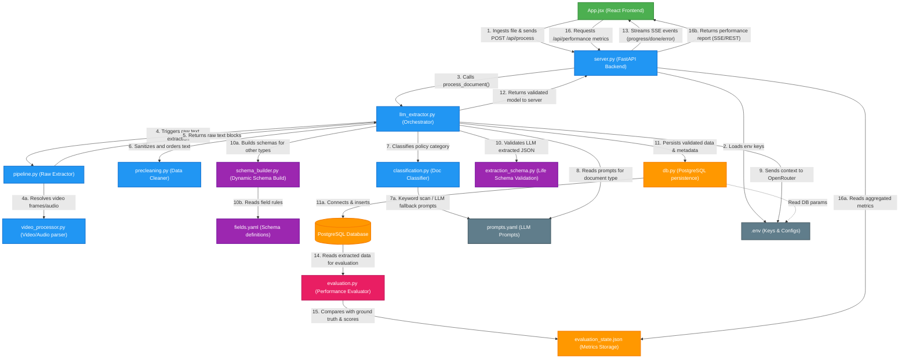

# Project File Interactions & Dependency Graph

This document illustrates how each file in the project interacts and connects during the end-to-end processing of a document, starting from the user's upload in the UI to final database persistence and UI updates.

---

## Interactive File Connection Diagram

Below is the Mermaid diagram showing the role and connection of every file involved in the pipeline:

---

## Step-by-Step File Walkthrough

### 1. Ingestion & Web API
* **[App.jsx](file:///d:/ppoc/frontend/src/App.jsx)**: The React user interface where a user drags and drops a document. It uploads the document to the server via an asynchronous HTTP POST request to `/api/process`.
* **[server.py](file:///d:/ppoc/backend/server.py)**: The FastAPI server that handles the upload, saves the file to a temporary location inside `/uploads`, initializes the database connection pool using `db.py`, runs the orchestrator in a worker thread, and streams Server-Sent Events (SSE) back to the UI.

### 2. Pipeline Orchestration
* **[llm_extractor.py](file:///d:/ppoc/backend/llm_extractor.py)**: The core pipeline orchestrator. It manages the sequence of operations: calls the raw extraction pipeline $\rightarrow$ precleaning $\rightarrow$ classification $\rightarrow$ LLM query $\rightarrow$ schema validation $\rightarrow$ database saving.

### 3. Text Extraction
* **[pipeline.py](file:///d:/ppoc/backend/pipeline.py)**: Ingests the file, determines its file type, and routes it to the correct extraction branch (PDF, standalone Image, Word documents, Audio, or Video).
* **[video_processor.py](file:///d:/ppoc/backend/video_processor.py)**: Imported by `pipeline.py` specifically when the file is a video. It extracts frames at regular intervals, evaluates scene changes using an SSIM (Structural Similarity) algorithm, runs OCR, transcribes audio using Whisper, and sorts all output chronologically.

### 4. Text Sanitization & Classification
* **[precleaning.py](file:///d:/ppoc/backend/precleaning.py)**: Cleans up unicode errors, normalizes dates, filters out noise (signatures/scrawl), deduplicates overlapping text boxes, and sorts extracted text blocks into correct reading order.
* **[classification.py](file:///d:/ppoc/backend/classification.py)**: Analyzes the cleaned text using a keyword scoring pre-screen (with fallback to an LLM) to classify the document into one of five types: `life`, `car`, `travel`, `health`, or `property`.

### 5. Validation & Schemas
* **[extraction_schema.py](file:///d:/ppoc/backend/extraction_schema.py)**: Houses the static Pydantic model (`PolicyExtraction`) and metadata validation validators for `life` insurance documents.
* **[schema_builder.py](file:///d:/ppoc/backend/schema_builder.py)**: Dynamically constructs Pydantic schemas at runtime for the other 4 insurance types (`car`, `travel`, `health`, `property`).
* **[fields.yaml](file:///d:/ppoc/backend/fields.yaml)**: Declares the structured field names, formats (e.g. date, phone, email, currency), and validation constraints read by `schema_builder.py`.

### 6. Persistence & Configuration
* **[db.py](file:///d:/ppoc/backend/db.py)**: The PostgreSQL database connector. It initializes tables and indexes, provides connection pooling, and inserts successful extraction data (into `extracted_data` JSONB) and validation metadata (into `meta_data` JSONB).
* **[prompts.yaml](file:///d:/ppoc/backend/prompts.yaml)**: Stores the externalized system and user prompts used by the classifier and the LLM extractor.
* **[.env](file:///d:/ppoc/.env)**: Holds the project credentials and configurations, including OpenRouter keys, Google Vision keys, and PostgreSQL database credentials.

### 7. Performance Evaluation & Metrics
* **[evaluation.py](file:///d:/ppoc/evaluation/evaluation.py)**: The performance evaluator that reads extracted data from the PostgreSQL database and compares it against ground truth files (`gt*.json`). It uses RapidFuzz similarity scoring (token_set_ratio) to calculate accuracy metrics, determines exact matches (similarity == 100%), and aggregates results by document type and field.
* **[evaluation_state.json](file:///d:/ppoc/evaluation/evaluation_state.json)**: The persistent metrics storage file that holds aggregated performance statistics including `overall_accuracy`, `avg_similarity`, `exact_matches`, per-type breakdown (`pdf`, `image`, `word`, `audio`, `video`), and field-wise accuracy tracking. This is read by the `/api/performance` endpoint on the backend.
* **Performance Display (App.jsx)**: The frontend displays performance metrics via the `AnalysisReport` modal component, which is triggered by the `PerformanceButton` in the results toolbar. The modal fetches data from `/api/performance`, displays color-coded document-wise analysis, and shows aggregated report metrics.
