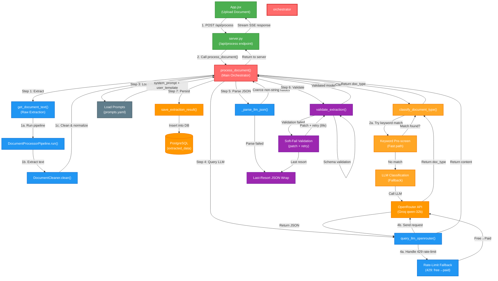

# LLM Extractor & Orchestration Architecture

This document details the core orchestration engine that manages the entire extraction pipeline: from raw text extraction through classification, LLM-based field extraction, validation, and database persistence.

---

## System Architecture



---

## Orchestration Flow: `process_document()`

The main orchestrator function that manages the complete extraction pipeline.

### Function Signature
```python
def process_document(file_path, api_key, model, extraction_mode="both"):
    """
    Orchestrates the complete extraction pipeline.
    
    Args:
        file_path (str): Path to document (PDF, image, Word, audio, or video)
        api_key (str): OpenRouter API key for LLM queries
        model (str): OpenRouter model ID (default: google/gemma-4-31b-it:free)
        extraction_mode (str): "both", "video_frames", "audio", "text" for video
    
    Returns:
        (doc_type, validated_model): Tuple of document type and validation result
        Returns (doc_type, None) if extraction/parsing fails
    """
```

### Step-by-Step Pipeline

#### Step 1: Raw Text Extraction
```python
document_text = get_document_text(file_path, extraction_mode=extraction_mode)
```

**What Happens:**
1. Calls `DocumentProcessorPipeline.run()` to extract raw text from document
   - Routes to correct extractor based on file type (PDF, Image, Word, Audio, Video)
   - Returns raw `text_sources` with bboxes and confidence scores
2. Calls `DocumentCleaner.clean()` for in-memory sanitization
   - Removes garbage (signatures, symbols, low-confidence noise)
   - Deduplicates overlapping blocks (IoU > 0.5 + similarity > 80%)
   - Normalizes unicode using ftfy
   - Sorts blocks into reading order
3. Concatenates cleaned text with page markers: `--- PAGE {n} ---`

**Output:**
```
--- PAGE 1 ---
Old Mutual Insure Ltd Pty Trading Projects
Policy Type: Personal Scheme
Period of Insurance: 01/01/2023 - 31/12/2024
The Insured: John Smith
...

--- PAGE 2 ---
Contact Details...
```

---

#### Step 2: Document Classification
```python
doc_type = classify_document_type(document_text, api_key, model)
```

**Classification Strategy** (Two-Tier System):

**Tier 1: Fast Keyword Pre-screen** (0% LLM cost)
```python
def _keyword_classify(text):
    # Threshold rules (order matters — first match wins)
    travel_patterns = [r"pnr\s*number", r"train\s*name", r"originating\s*station", ...]
    car_patterns = [r"registration\s*number", r"engine\s*number", ...]
    health_patterns = [r"basic\s*floater\s*sum\s*insured", ...]
    property_patterns = [r"the\s*business\s*:", ...]
    life_patterns = [r"personal\s*scheme", r"policyholder\s*details", ...]
    
    # Scoring thresholds
    travel/car/health/property: Need 2+ pattern matches → confirmed
    life: Need only 1+ pattern match → confirmed (catches fragmented OCR)
```

**Hit Examples:**
```
"train name" + "originating station" found → travel (2 hits)
"personal scheme" found → life (1 hit sufficient)
"registration number" + "engine number" found → car (2 hits)
```

**Tier 2: LLM Fallback** (Costly, but required for edge cases)
- If keyword screen returns empty string, calls LLM classifier
- Sends first 4000 chars of document text
- LLM returns `{"doc_type": "life|car|health|property|travel"}`
- Includes regex fallback extraction if JSON parse fails

**Valid Types:**
```python
VALID_TYPES = {"car", "life", "health", "property", "travel"}
# Falls back to "life" if everything fails (most common type)
```

---

#### Step 3: Load Type-Specific Prompts
```python
type_prompts = PROMPTS.get(doc_type)
system_prompt = type_prompts["system_prompt"]
user_prompt_template = type_prompts["user_prompt_template"]
```

**Prompt Structure** (from `prompts.yaml`):
```yaml
life:
  system_prompt: |
    You are an insurance document field extractor...
    Extract the following fields as JSON: insured_name, date_of_birth, ...
  user_prompt_template: |
    Document text:
    {document_text}
    
    Extract all fields and return as JSON.
```

**Error Handling:**
- If doc_type has no prompts configured → raise `ValueError`
- Prevents silent failures on missing doc types

---

#### Step 4: Query LLM via OpenRouter
```python
extracted_content = query_llm_openrouter(
    document_text, api_key, model, 
    system_prompt, user_prompt_template
)
```

**Request Configuration:**
```python
payload = {
    "model": model,  # e.g., "google/gemma-4-31b-it:free"
    "messages": [
        {"role": "system", "content": system_prompt},
        {"role": "user", "content": user_prompt_template.format(document_text=document_text)}
    ],
    "temperature": 0.1,        # Low temperature = deterministic extraction
    "max_tokens": 4096,        # Max response length
    "response_format": {"type": "json_object"}  # Force JSON output
}
```

**Parameters Explanation:**
- **temperature=0.1**: Near-deterministic output (reduces hallucination)
- **max_tokens=4096**: Sufficient for multi-field JSON extraction
- **response_format=json_object**: Forces compliant JSON (some models strict about this)

**Rate-Limit Fallback (429 Handler):**
```python
if response.status_code == 429 and model.endswith(":free"):
    fallback_model = model[:-5]  # Remove ":free" suffix
    print(f"Rate-limit hit. Falling back from {model} to {fallback_model}")
    return query_llm_openrouter(..., model=fallback_model)  # Recursive call
```

**Example:**
```
429 hit on "google/gemma-4-31b-it:free"
→ Retry as "google/gemma-4-31b-it" (paid tier)
→ Charged actual credits instead of 0 credits
```

**Other Error Handling:**
```python
if response.status_code == 402:
    # Insufficient OpenRouter credits
    raise RuntimeError(f"[402] Insufficient credits: {err_msg}")

if response.status_code != 200:
    # Generic API error
    raise RuntimeError(f"OpenRouter failed ({status}): {response.text}")
```

**Token Logging:**
```
LLM call latency: 2.34s
Token usage -> input: 1245, output: 342, total: 1587
```

---

#### Step 5: Parse LLM JSON Output
```python
parsed_json = _parse_llm_json(extracted_content)
```

**Parsing Strategy** (Fault-Tolerant):

**Attempt 1: Direct JSON parse**
```python
try:
    parsed = json.loads(raw_content.strip())
except json.JSONDecodeError:
    # Continue to Attempt 2
```

**Attempt 2: Fence removal + retry**
```python
# Remove markdown code fences
if raw_content.startswith("```"):
    lines = raw_content.split("\n")
    lines = lines[1:]  # Remove opening fence
    lines = lines[:-1] if lines[-1].startswith("```") else lines  # Remove closing
    cleaned = "\n".join(lines).strip()
    parsed = json.loads(cleaned)
```

**Fallback: Print raw output & return None**
```python
if still fails:
    print("[!] Warning: LLM output was not valid JSON")
    print(raw_content)
    return None  # Marks extraction as failed
```

**Value Coercion** (Handles model-specific quirks):
```python
# Some models return -1, null, 0, false instead of ""
# Coerce ALL non-string values to empty string
if isinstance(parsed, dict):
    parsed = {k: ("" if not isinstance(v, str) else v) for k, v in parsed.items()}
```

**Example Coercions:**
```json
Input:  {"insured_name": "John", "date_of_birth": -1, "occupation": null}
Output: {"insured_name": "John", "date_of_birth": "", "occupation": ""}
```

---

#### Step 6: Validate Against Schema
```python
validated = validate_extraction(doc_type, parsed_json, document_text=document_text)
```

**Three-Tier Validation Strategy:**

**Tier 1: Schema Validation** (Hard-fail on required fields only)
```python
if doc_type == "life":
    # Use hand-tuned PolicyExtraction from extraction_schema.py
    # Removes removed fields first
    clean = {k: v for k, v in parsed_json.items() 
             if k not in _LIFE_REMOVED_FIELDS}
    model_cls = build_model("life")
    validated = model_cls.model_validate(clean)
else:
    # Use dynamically-built schema from schema_builder.py
    model_cls = build_model(doc_type)
    validated = model_cls.model_validate(parsed_json)
```

**Tier 2: Soft-Fail Patching** (If Tier 1 validation fails)
```python
except ValidationError as e:
    print("[!] Schema validation failed (soft fallback):")
    for err in e.errors():
        print(f"    {field}: {err['msg']}")
    
    # For life type only: patch empty required fields
    if doc_type == "life":
        patched = dict(parsed_json)
        if not patched.get("insurer_name"):
            patched["insurer_name"] = "Unknown"
        if not patched.get("intermediary_name"):
            patched["intermediary_name"] = "Unknown"
        try:
            return _validate_life_extraction(patched)  # Retry
        except ValidationError:
            pass  # Continue to Tier 3
```

**Tier 3: Last-Resort JSON Wrapping** (Ultimate fallback)
```python
# Validation still fails → return raw JSON wrapped
from types import SimpleNamespace

# Strip removed fields so they never leak through
stripped = {k: v for k, v in parsed_json.items() 
            if k not in _LIFE_REMOVED_FIELDS}

# Wrap in namespace that supports .model_dump() and .model_dump_json()
ns = SimpleNamespace()
ns.model_dump = lambda: dict(stripped)
ns.model_dump_json = lambda indent=2, by_alias=False: json.dumps(stripped, indent=indent)

print("[!] Returning raw extracted fields without schema validation")
return ns
```

**Why This Three-Tier Approach?**
- Tier 1: Catch typos and format errors (99% of cases)
- Tier 2: Patch specific known-bad fields (life schema quirk)
- Tier 3: Let frontend/evaluation deal with any remaining issues (transparent failure)

---

#### Step 7: Persist to Database
```python
from db import init_db_pool, save_extraction_result

init_db_pool()
filename = os.path.basename(file_path)
data_dict = validated.model_dump()

save_extraction_result(
    filename=filename,
    doc_type=doc_type,
    status="success",
    validated_data=data_dict
)
```

**Database Insertion:**
- Table: `extracted_data`
- Columns: `filename`, `doc_type`, `status` (success/failed), `validated_data` (JSONB)
- Also captures metadata in `meta_data` column (timestamps, source, etc.)

**Error Handling:**
```python
try:
    save_extraction_result(...)
except Exception as db_err:
    print(f"[!] Database save error: {db_err}")
    # Does not stop extraction — warning only
    # Data still returned to frontend/evaluation
```

---

#### Step 8: Return Results
```python
print(f"[*] Total processing time: {time.time() - overall_start:.2f}s")
return doc_type, validated
```

**Return Value:**
```python
# Success
("life", PolicyExtraction(...))

# Partial failure (parsing failed)
("life", None)

# Complete failure (exception)
# Exception raised, caught by server.py
```

---

## Removed Fields Policy

**For Life Insurance Only:**
```python
_LIFE_REMOVED_FIELDS = {"policy_type", "policy_status"}
```

**Behavior:**
- Stripped at two points:
  1. Before schema validation (`_validate_life_extraction`)
  2. Before JSON wrapping in Tier 3 fallback
- Never appear in final output, database, or evaluation
- Reason: Schema evolution — fields no longer required in current version

---

## Thresholds & Parameters

### Extraction Thresholds

#### Confidence Tiers (in precleaning)
```python
high_confidence_threshold = 0.90      # ≥90% → trusted text
medium_confidence_threshold = 0.70    # 70-89% → medium quality
# < 70% → low confidence (eligible for garbage detection)
```

#### Garbage Detection (in precleaning)
```python
garbage_score_threshold = 60.0        # Word-likeness score < 60% + medium conf → garbage
iou_threshold = 0.5                   # IoU > 0.5 between bboxes → potential duplicate
text_sim_threshold = 80.0             # Text similarity > 80% + IoU > 0.5 → deduplicate
ocr_fix_similarity_threshold = 75.0   # RapidFuzz score > 75% → safe OCR correction
```

#### Signature Detection (in precleaning)
```python
is_short = len(text.strip()) <= 8                          # ≤8 chars
is_unusually_tall = box_height > typical_line_height * 2.5  # >2.5× normal height
is_lowish_confidence = confidence < high_confidence_threshold
# All three → likely signature/scrawl → DROP
```

### LLM Parameters

#### OpenRouter Request
```python
temperature = 0.1          # Near-deterministic (low creativity)
max_tokens = 4096          # Max response length
response_format = "json_object"  # Force valid JSON
```

#### Classification LLM Request
```python
temperature = 0.0          # Fully deterministic
response_format = "json_object"
# Only first 4000 chars of document (cost optimization)
```

### Classification Keyword Thresholds
```python
travel_threshold = 2       # Need 2 matches
car_threshold = 2          # Need 2 matches
health_threshold = 2       # Need 2 matches
property_threshold = 2     # Need 2 matches
life_threshold = 1         # Need only 1 match (catches fragmented OCR)
```

---

## Fallback Mechanisms Summary

### 1. Rate-Limit Fallback (429 Handler)
```python
if status_code == 429 and model.endswith(":free"):
    fallback_model = model[:-5]  # Free → Paid tier
    return query_llm_openrouter(..., model=fallback_model)
```

**Trigger:** OpenRouter returns 429 (rate-limited)
**Action:** Retry with paid model tier
**Example:** `google/gemma-4-31b-it:free` → `google/gemma-4-31b-it`

### 2. Classification Fallback (Keyword → LLM)
```python
kw_result = _keyword_classify(document_text)
if not kw_result:
    return classify_via_llm(document_text, api_key, model)
```

**Trigger:** Keyword screen returns empty string (no threshold met)
**Action:** Query LLM classifier
**Cost:** One additional LLM call

### 3. Soft-Fail Validation (Patching)
```python
except ValidationError:
    if doc_type == "life":
        patched = dict(parsed_json)
        if not patched.get("insurer_name"):
            patched["insurer_name"] = "Unknown"
        if not patched.get("intermediary_name"):
            patched["intermediary_name"] = "Unknown"
        return validate_again(patched)
```

**Trigger:** Schema validation fails
**Action:** Patch `insurer_name` and `intermediary_name` with "Unknown", retry
**Scope:** Life insurance only

### 4. Last-Resort JSON Wrapping
```python
# Still failed?
return SimpleNamespace(
    model_dump=lambda: raw_json,
    model_dump_json=lambda: json.dumps(raw_json)
)
```

**Trigger:** All validation attempts failed
**Action:** Return raw JSON wrapped in object supporting `.model_dump()`
**Transparency:** Allows evaluation.py and frontend to work with raw data

### 5. Classification Default Fallback
```python
# After all attempts, if doc_type still invalid
return "life"  # Default to most common type
```

**Trigger:** Keyword screen, LLM, and regex all fail
**Action:** Default to "life"
**Rationale:** Most common type in test set

### 6. Extraction Failure & Database Logging
```python
if parsed_json is None:
    save_extraction_result(
        filename=os.path.basename(file_path),
        doc_type=doc_type,
        status="failed",
        validated_data={}
    )
    return doc_type, None
```

**Trigger:** JSON parsing fails completely
**Action:** Mark extraction as "failed" in database, return `None`
**Side Effect:** Database logs failure for audit trail

---

## Error Handling Map

| Error Type | Trigger | Fallback | Outcome |
|-----------|---------|----------|---------|
| 429 (Rate Limit) | Free model quota exhausted | Switch to paid tier | Retry succeeds (charged credits) |
| 402 (Credits) | Insufficient OpenRouter credits | Raise exception | Extraction fails |
| Invalid JSON | LLM returns non-JSON or invalid structure | Fence removal + retry | If still fails, returns `None` |
| Classification Fail | Keyword screen + LLM both fail | Default to "life" | Extraction continues (may be misclassified) |
| Validation Fail | Schema doesn't match | Patch (life) or wrap (all) | Returns partial/raw JSON |
| DB Error | Database unavailable | Log warning, continue | Data still returned to frontend |

---

## Command-Line Interface

### Standalone Usage
```bash
# Interactive file selection
python llm_extractor.py

# Direct file path
python llm_extractor.py /path/to/document.pdf

# Custom model
python llm_extractor.py /path/to/document.pdf --model anthropic/claude-3-opus

# Custom API key
python llm_extractor.py /path/to/document.pdf --api-key sk-...
```

### Environment Variables
```bash
export OPENROUTER_API_KEY=sk-...
export OPENROUTER_MODEL=google/gemma-4-31b-it:free
export GROQ_API_KEY=gsk_...  # Used by classification.py

python llm_extractor.py /path/to/document.pdf
```

### Return Codes
```
0: Success
1: File not found or extraction failed
N/A: Exception raised and caught by server.py
```

---

## Performance Characteristics

### Typical Latencies
```
Step 1 (Extraction): 0.5-3.0s   (depends on document size/type)
Step 2 (Classification):
  - Keyword path: ~10ms
  - LLM path: ~1.5-2.0s
Step 3-4 (LLM Query): 2-8s       (depends on model and document length)
Step 5-6 (Parsing + Validation): ~100-200ms
Step 7 (Database): ~50-100ms
────────────────────────────────
Total: 3-15s per document
```

### Token Usage
```
Typical extraction request (document ~50KB):
  Input tokens: 1000-1500
  Output tokens: 200-400
  Total: 1200-1900 tokens

Classification request (first 4000 chars only):
  Input tokens: 500-700
  Output tokens: 50-100
  Total: 550-800 tokens
```

### Cost Estimation (Free Tier)
- Gemma 4 free tier: ~50-100 requests/day before rate-limit
- After rate-limit: Cascades to paid tier (~$0.01-0.05 per extraction)
- Classification: Usually keyword-cached (free)

---

## Integration Points

### Frontend (App.jsx)
```javascript
const response = await fetch('/api/process', {
  method: 'POST',
  body: formData,  // Contains file + extraction_mode
  headers: { 'Accept': 'text/event-stream' }
});

// SSE events streamed by server.py
// Calls llm_extractor.process_document() internally
```

### Backend (server.py)
```python
from llm_extractor import process_document, load_env_file

@app.post("/api/process")
def process_endpoint(file: UploadFile, extraction_mode: str = "both"):
    load_env_file()
    # Runs in worker thread
    doc_type, validated = process_document(
        file_path, api_key, model, extraction_mode
    )
    # Streams SSE response
```

### Evaluation (evaluation.py)
```python
from llm_extractor import process_document

_, validated = process_document(filepath, api_key, model)
prediction = validated.model_dump()

# Compared against ground truth
```

### Classification (classification.py)
```python
from classification import classify_document_type

doc_type = classify_document_type(document_text, api_key, model)
# Returns: "life" | "car" | "health" | "property" | "travel"
```

### Schema Building (schema_builder.py)
```python
from schema_builder import build_model

model_cls = build_model(doc_type)
validated = model_cls.model_validate(parsed_json)
```

### Precleaning (precleaning.py)
```python
from precleaning import DocumentCleaner

cleaner = DocumentCleaner(drop_garbage=False)
cleaned_result = cleaner.clean(raw_result)
```

---

## Troubleshooting

### Issue: "Rate-limit (429) for free model"
**Cause:** OpenRouter free tier quota exhausted
**Solution:** 
- Automatic: Cascades to paid tier (charged credits)
- Manual: Switch to paid model: `--model google/gemma-4-31b-it`
- Check credits: Visit OpenRouter dashboard

### Issue: "Insufficient OpenRouter credits (402)"
**Cause:** Account out of credits
**Solution:** Add credits to OpenRouter account

### Issue: "No prompts configured for doc_type"
**Cause:** New doc_type added to `classify_document_type()` without prompts.yaml entry
**Solution:** Add system_prompt + user_prompt_template for new type in prompts.yaml

### Issue: "Schema validation failed" repeated
**Cause:** LLM returning fields that don't match expected types
**Solution:** 
- Check prompts.yaml — may need to be more specific about field types
- Review samples in ground truth — LLM may be matching different field values

### Issue: Wrong document classification
**Cause:** Keyword patterns don't match document, LLM misclassified
**Solution:**
- Check keyword patterns in classification.py
- Review classification system prompt in classification.py
- Add keywords specific to your domain

---

## Architecture Decisions

### Why Three-Tier Validation?
- **Tier 1**: Catches most errors at schema level
- **Tier 2**: Handles known life insurance schema quirks without validation bloat
- **Tier 3**: Ensures extraction never fails, allowing frontend/evaluation to handle edge cases

### Why Soft-Fail for Non-Life?
- Life insurance has hand-tuned schema based on real OCR failures
- Other types use generic schema from fields.yaml
- Soft-fail allows extraction to continue with partial data
- Evaluation metrics show actual field accuracy, not binary success/failure

### Why Two-Tier Classification?
- **Keyword**: Fast, free, sufficient for 80%+ of documents
- **LLM**: Expensive fallback, catches ambiguous/unusual documents
- Saves ~80% of LLM calls

### Why temperature=0.1 for Extraction?
- Near-deterministic behavior reduces hallucination
- 0.0 is sometimes too rigid (some models refuse JSON with 0.0)
- 0.1 provides good balance: deterministic + permissive


---

