# Precleaning Architecture & Data Flow

This document details the architecture, component connections, and data flow of the Document Cleaner implemented in [precleaning.py](file:///d:/ppoc/precleaning.py).

It is the second stage in the in-memory document pipeline: `pipeline.py` produces a raw extraction result; `precleaning.py` consumes that same in-memory dict and returns a cleaned version of it. No files are written or read in between -- both stages operate on Python dicts passed directly from one to the other.

---

## High-Level Architecture Flow

The following diagram illustrates how a page's raw `text_sources` blocks move through six cleaning stages and come out the other side as `cleaned_text_sources`, in the same schema as the input.

```mermaid
graph TD
    PipelineResult["DocumentProcessorPipeline.run() result (in-memory dict)"] --> CleanEntry["DocumentCleaner.clean(result)"]

    CleanEntry --> PageLoop["Iterate through pages (1 to N)"]
    PageLoop --> ClnPage["DocumentCleaner.clean_page(page)"]

    subgraph "clean_page: 6-Stage Pipeline"
        ClnPage --> WorkCopy["Copy text_sources into working_blocks (originals untouched)"]
        WorkCopy --> LineHeight["Compute typical_line_height (median block height on page)"]

        LineHeight --> Stage12{"drop_garbage enabled?"}
        Stage12 -->|"Yes"| GarbageCheck["Stage 1+2: tier_by_confidence + is_likely_garbage\n(signature heuristic, symbol-only check, word-likeness via RapidFuzz)"]
        GarbageCheck --> DropGarbage["Drop blocks flagged as garbage"]
        Stage12 -->|"No (default)"| SkipDrop["Keep all blocks"]

        DropGarbage --> Stage3["Stage 3: normalize_text per block\n(ftfy unicode repair -> whitespace collapse -> punctuation strip -> RapidFuzz domain-dictionary correction)"]
        SkipDrop --> Stage3

        Stage3 --> CorrTag{"Correction applied?"}
        CorrTag -->|"Yes"| TagCorrected["Attach corrected_from = original text"]
        CorrTag -->|"No"| NoTag["No extra field"]

        TagCorrected --> Stage4["Stage 4: normalize_dates\n(standardize separators to '/')"]
        NoTag --> Stage4

        Stage4 --> DropEmpty["Drop blocks now empty or symbol-only after normalization"]
        DropEmpty --> Stage5["Stage 5: deduplicate\n(bbox IoU + RapidFuzz text similarity, embedded preferred over ocr)"]
        Stage5 --> Assemble["Assemble output blocks: source, text, bbox, confidence [, corrected_from]"]

    end

    Assemble --> NewPage["New page dict: text_sources (untouched) + cleaned_text_sources"]
    NewPage --> Aggregate["Aggregate cleaning_metadata: total_blocks_before/after, duration_ms"]
    Aggregate --> Result["Return new in-memory result dict"]
```

---

## Detailed Component Roles

### 1. Entry Point
- **Method**: `DocumentCleaner.clean(result)`
- **Role**: Mirrors `DocumentProcessorPipeline.run()` -- takes the full pipeline result dict and returns a new dict. Iterates every page through `clean_page`, then computes a small top-level `cleaning_metadata` block (`total_blocks_before`, `total_blocks_after`, `cleaning_duration_ms`). Nothing is written to disk; the return value is the only output.

### 2. Page-Level Orchestration
- **Method**: `clean_page(page)`
- **Role**: Runs all six stages on one page's `text_sources` list and returns a new page dict. The original `text_sources` list is never mutated -- `clean_page` works on `dict(b) for b in original_blocks` copies, and the final output is reassembled into plain dicts containing only the original schema fields. This is what keeps `cleaned_text_sources` lean: diagnostic fields computed mid-pipeline (confidence tier, garbage flags, line-band id) live only on the working copies and are discarded before the result is returned.

### 3. Stage 1 + 2 -- Confidence Tiering & Garbage/Signature Detection (optional drop)
- **Methods**: `tier_by_confidence`, `is_likely_signature_or_scrawl`, `is_single_char_or_symbol_only`, `_word_likeness_score`, `_is_likely_garbage`
- **Role**: Identifies blocks that are likely noise rather than genuine document text, so they can optionally be dropped before further processing.
- **Signature/scrawl detection**: compares a block's height against the page's own `typical_line_height` (median block height) rather than a fixed aspect-ratio rule. A short, unusually tall, sub-perfect-confidence block (e.g. a handwritten signature scrawled across a signature line) gets flagged. This avoids a known false-negative: a signature can be wide-and-short in raw bbox terms while still being far taller than the page's normal text rows.
- **Symbol-only detection**: catches stray single/double-character artifacts (`"-"`, `"."`, `"|"`) with a simple regex, no scoring needed.
- **Word-likeness scoring**: uses RapidFuzz to compare each alphabetic token against a small reference wordlist (generic English terms plus the supplied `domain_dictionary`, deduplicated). Code-like tokens (e.g. `"MUP"` inside `"MUP-4250424-04-0071128"`) are excluded from this check via `_CODE_LIKE_TOKEN`, since scoring an acronym embedded in a serial number against an English wordlist is meaningless.
- **Combined verdict**: a block is "likely garbage" if it's a signature/scrawl, OR symbol-only, OR has both a low word-likeness score AND confidence below the medium threshold. The AND-gating on the word-likeness check is deliberate -- a wordlist can never cover every real word (proper nouns, place names, abbreviations), so word-likeness alone is too weak a signal to act on; pairing it with low OCR confidence reduces false positives.
- **Behavior**: only takes effect when `drop_garbage=True` is passed to the constructor (default `False`). When disabled, every block proceeds to Stage 3 regardless of this verdict -- nothing is silently lost by default.

### 4. Stage 3 -- Text Normalization
- **Methods**: `normalize_unicode` (ftfy), `strip_and_collapse_whitespace`, `strip_leading_trailing_punctuation_noise`, `fix_common_ocr_substitutions` (RapidFuzz), `normalize_text` (orchestrates the above)
- **Role**: Cleans each block's raw text string through four sub-steps, in order:
  1. **Unicode repair (ftfy)**: fixes mojibake from PyMuPDF's text extraction on PDFs with unusual font/CMap encodings, decodes stray HTML entities, and normalizes smart quotes/dashes/non-breaking spaces to plain ASCII, all via `ftfy.fix_text(text, normalization="NFKC")`.
  2. **Whitespace collapse**: `re.sub(r"\s+", " ", text.strip())`.
  3. **Punctuation noise stripping**: removes leading stray colons/dashes from OCR box-splitting artifacts (e.g. `":415028272267"` -> `"415028272267"`), and collapses repeated trailing punctuation (`"value.."` -> `"value."`).
  4. **Domain-dictionary OCR correction (RapidFuzz)**: tokenizes the text on spaces; for each alphabetic token of length 4 or more, finds the closest match in `domain_dictionary` via `rapidfuzz.process.extractOne` with `fuzz.ratio`. If the match score clears `ocr_fix_similarity_threshold` (default 85) and the matched term differs from the original token, the token is replaced.
- **Why ftfy and RapidFuzz are not redundant**: ftfy repairs encoding-level corruption (wrong charset decoding -- a structural problem with the bytes), while RapidFuzz repairs visual OCR misreads against a known vocabulary (a content problem with what PaddleOCR thought it saw, e.g. reading "Mutral" for "Mutual"). They operate on different failure modes and both run on every block.
- **Threshold rationale**: 85 was chosen deliberately conservative after testing showed a lower threshold (e.g. 80) caused real words to get incorrectly "corrected" to other real words in the dictionary (e.g. "Insured" to "Insurer" at score 85.7) -- a worse outcome than leaving a genuine typo uncorrected. Tighter, more specific dictionaries reduce this collision risk; the threshold can be lowered safely the smaller and more precise `domain_dictionary` is.
- **Output tagging**: if `fix_common_ocr_substitutions` made any change, the block's pre-correction text is preserved in a `corrected_from` field on the working copy, which survives into the final output. Blocks with no correction never get this field at all -- it's additive, not a blank placeholder.

### 5. Stage 4 -- Date Normalization
- **Method**: `normalize_dates`
- **Role**: Standardizes date separators to `/` via a single regex substitution (`_DATE_PATTERN`), e.g. `"08-11-2024"` -> `"08/11/2024"`, `"08.11.2024"` -> `"08/11/2024"`. Runs after Stage 3 so it operates on already-normalized text.

### 6. Post-Normalization Empty-Block Drop
- **Role**: After Stages 3-4, a block's text may have collapsed to nothing or to a meaningless leftover symbol (e.g. raw text `"..."` reduced by punctuation stripping to a lone `"."`). These blocks are filtered out using the same `is_single_char_or_symbol_only` check used in Stage 2, applied to the post-normalization text rather than the original. This is unconditional (not gated by `drop_garbage`) since a block with no real content left has nothing for downstream consumers to use regardless.

### 7. Stage 5 -- Deduplication
- **Methods**: `compute_bbox_overlap` (IoU), `compute_text_similarity` (RapidFuzz `fuzz.ratio`), `find_duplicate_pairs`, `resolve_duplicate`, `deduplicate`
- **Role**: Resolves the case where the same physical text on a page was captured twice -- once as PyMuPDF embedded text and once as a PaddleOCR reading of an overlapping image region (the scenario `pipeline.py`'s PDF branch can produce when both embedded text and image regions exist on a page).
- **Detection**: only compares block pairs with different `source` values (`embedded` vs `ocr`) -- two blocks from the same source are not considered duplicates of each other, since the pipeline doesn't produce same-source overlaps by construction. A pair is flagged as a duplicate only when both the bbox IoU exceeds `iou_threshold` (default 0.5) AND the RapidFuzz text similarity exceeds `text_sim_threshold` (default 80) -- spatial overlap alone isn't sufficient (two unrelated short labels could happen to overlap), and text similarity alone isn't sufficient (the same word could legitimately appear twice on a page in different places).
- **Resolution**: when a duplicate pair is found, `embedded` is always preferred over `ocr` (exact text extraction, confidence fixed at 1.0, versus a probabilistic OCR read); if both blocks share the same source somehow, the higher-confidence one wins.
.

### 8. Output Assembly & In-Memory Result
- **Role**: For each page, the final `cleaned_text_sources` list is built by re-reading only four fields off each surviving, ordered working block (`source`, `text`, `bbox`, `confidence`), plus `corrected_from` when present. No other intermediate field (confidence tier, garbage verdict, word-likeness score, line-band id, etc.) is copied into this output -- those exist only as working-copy state used to make decisions during cleaning, never as persisted data.
- **Original data preserved**: `page["text_sources"]` is never reassigned or mutated; `new_page = dict(page)` followed by `new_page["cleaned_text_sources"] = clean_blocks` means both the raw and cleaned versions coexist in the same page dict, the same audit-trail pattern as the original `pipeline.py`'s embedded-vs-ocr split.
- **Output format**: in-memory only, by design -- `DocumentCleaner.clean()` returns a dict and writes nothing to disk. The optional CLI entry point (`main()`, used only when running `precleaning.py` directly from the command line for testing) is the sole place that touches the filesystem, reading a previously saved pipeline JSON and writing a `<input>_cleaned.json` alongside it; this is a convenience wrapper around the in-memory `clean()` call, not part of the core in-memory contract between `pipeline.py` and `precleaning.py`.

---

## Configuration Reference

All thresholds are constructor parameters on `DocumentCleaner`, with the defaults used throughout this document:

| Parameter | Default | Used In |
|---|---|---|
| `high_confidence_threshold` | 0.90 | Stage 1 tiering, Stage 2 signature check |
| `medium_confidence_threshold` | 0.70 | Stage 1 tiering, Stage 2 word-likeness gating |
| `garbage_score_threshold` | 60.0 | Stage 2 word-likeness verdict |
| `drop_garbage` | False | Gates whether Stage 2's verdict actually removes blocks |
| `iou_threshold` | 0.5 | Stage 5 duplicate bbox-overlap requirement |
| `text_sim_threshold` | 80.0 | Stage 5 duplicate text-similarity requirement |
| `ocr_fix_similarity_threshold` | 85.0 | Stage 3 domain-dictionary correction confidence |
| `line_band_tolerance_px` | 5.0 | Stage 6 line-band center-matching tolerance |
| `domain_dictionary` | [] | Stage 3 correction targets + Stage 2 wordlist supplement |

`domain_dictionary` is the one parameter expected to be set per-document-type in practice (e.g. known insurer names, field labels) -- the tighter and more specific this list, the safer it is to lower `ocr_fix_similarity_threshold` without risking incorrect corrections between two real, differently-spelled terms.
