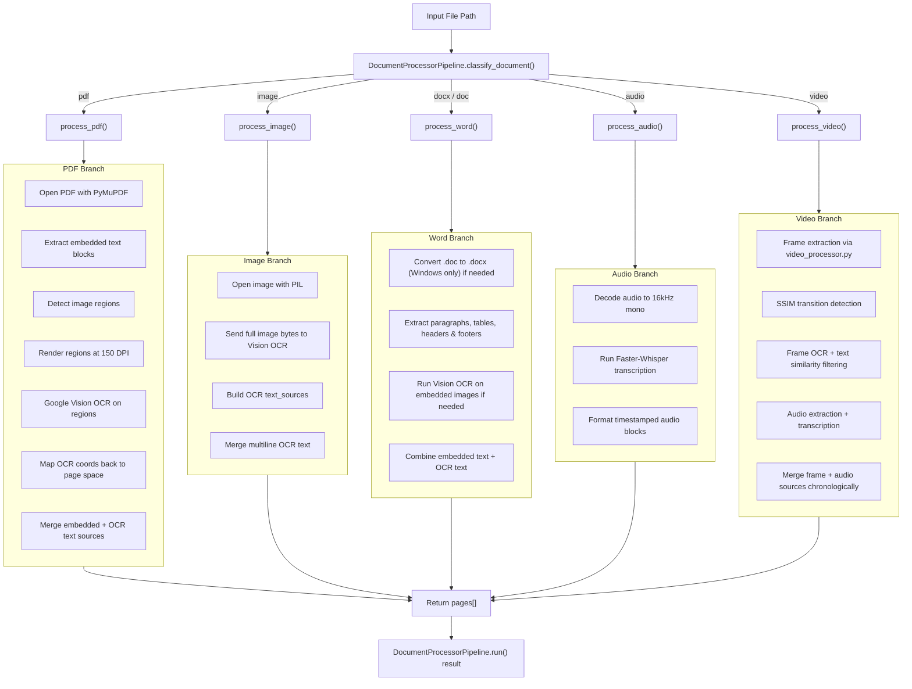

# Raw Data Extraction Architecture

This document describes the raw data extraction pipeline implemented in `backend/pipeline.py` and `backend/video_processor.py`. It covers every supported input type: PDF, Word, Image, Audio, and Video.

---

## Architecture Overview



---

## Entry Point: `DocumentProcessorPipeline.run()`

This is the top-level method used by the backend orchestrator.

### Behavior
* Verifies the file exists.
* Classifies the document by extension using `classify_document()`.
* Dispatches to one of:
  * `process_pdf()`
  * `process_image()`
  * `process_word()`
  * `process_audio()`
  * `process_video()`
* Measures `processing_time_ms`.
* Returns a dictionary containing:
  * `document_id`
  * `document_name`
  * `document_type`
  * `total_pages`
  * `processing_time_ms`
  * `pages`

### Result Schema
```json
{
  "document_id": "...",
  "document_name": "file.pdf",
  "document_type": "pdf",
  "total_pages": 3,
  "processing_time_ms": 2045,
  "pages": [
    {
      "page_number": 1,
      "width": 595.0,
      "height": 842.0,
      "text_sources": [ ... ]
    }
  ]
}
```

---

## Document Classification

### `classify_document(file_path)`
Determines the branch using file extension.

Supported outputs:
* `.pdf` → `pdf`
* `.png`, `.jpg`, `.jpeg`, `.tiff`, `.bmp`, `.webp` → `image`
* `.docx` → `docx`
* `.doc` → `doc`
* `.wav`, `.mp3`, `.m4a`, `.aac`, `.flac` → `audio`
* `.mp4`, `.avi`, `.mov`, `.mkv`, `.webm` → `video`

If an unsupported extension is supplied, the method raises a `ValueError`.

---

## PDF Branch: `process_pdf()`

### Purpose
Extracts text from PDF pages using both native embedded text and Vision OCR for scanned images inside the PDF.

### Workflow
1. Open the PDF using `fitz.open(file_path)`.
2. Iterate over each page.
3. Extract embedded text blocks using `page.get_text("blocks")`.
   * Blocks are filtered for actual text.
   * Text blocks are returned as `source: embedded`, `confidence: 1.0`.
4. Detect embedded image regions using `page.get_image_info()`.
5. Conditionally run Vision OCR on image regions if:
   * `embedded_chars < 50`, or
   * `force_ocr=True`
6. Render each image region at `150 DPI` using `page.get_pixmap(clip=rect, dpi=150)`.
7. Convert the rendered bytes to PNG and send to Vision OCR.
8. Map OCR coordinates from cropped image pixels back into PDF page points.
9. Merge embedded text and OCR text sources.
10. Normalize same-row label/value pairs, then call `merge_multiline_ocr()`.
11. Return a page object with `text_sources`.

### Special Details
* Embedded text is captured directly from PDF vectors.
* The pipeline avoids unnecessary OCR when the page already has enough embedded text.
* OCR text blocks are mapped back to original PDF coordinates using the render DPI scale factor.

### Coordinate Mapping
Given a cropped image region with origin `(rx0, ry0)` on the page and pixel coordinates `(ox0, oy0, ox1, oy1)`, the PDF coordinates are computed as:
```python
scale_factor = 72.0 / 150.0
page_x0 = rx0 + ox0 * scale_factor
page_y0 = ry0 + oy0 * scale_factor
page_x1 = rx0 + ox1 * scale_factor
page_y1 = ry0 + oy1 * scale_factor
```

### Output Example
Each OCR block is returned like:
```json
{
  "source": "ocr",
  "text": "John Smith",
  "bbox": [12.5, 56.0, 130.2, 72.4],
  "confidence": 0.94,
  "metadata": {"bbox": [12.5, 56.0, 130.2, 72.4]}
}
```

---

## Image Branch: `process_image()`

### Purpose
Runs Vision OCR on a standalone image and produces structured text blocks.

### Workflow
1. Open the file with `PIL.Image.open(file_path).convert("RGB")`.
2. Read raw bytes from disk.
3. Send the entire image to `_vision_ocr(image_bytes)`.
4. Build `text_sources` from returned words.
5. Merge multiline OCR results via `merge_multiline_ocr()`.
6. Return a single page with `ocr_duration_ms`.

### Output Notes
* Every block is marked `source: ocr`.
* Bounding boxes are based on image pixel space.
* Confidence is taken from Vision OCR word confidence.

---

## Word Branch: `process_word()`

### Supported Types
* `.docx` → direct extraction
* `.doc` → converted to `.docx` using `win32com` on Windows

### Workflow
1. If the file extension is `.doc`, convert it to `.docx` using `convert_doc_to_docx()`.
2. Load the document with `python-docx`.
3. Extract text from:
   * headers and footers
   * paragraphs
   * tables
4. Each extracted text block is emitted as `source: embedded`.
5. If `embedded_chars < 50` or `force_ocr=True`, run OCR on embedded images.
   * Images are extracted from document parts and passed to Vision OCR.
   * OCR image blocks are appended as `source: ocr`.
6. Return a single page object with the merged text sources.

### Notes
* `bbox` values for Word text are often `[0.0, 0.0, 0.0, 0.0]` because layout coordinates are not available from `python-docx`.
* The pipeline deduplicates repeated images using hash-based detection.
* Temporary `.docx` files are cleaned up after processing.

---

## Audio Branch: `process_audio()`

### Purpose
Transcribes audio into timestamped text blocks using Faster-Whisper.

### Workflow
1. Decode audio to 16kHz mono using `faster_whisper.audio.decode_audio()`.
2. Transcribe using `self.whisper.transcribe(audio_data)`.
3. For each segment, build a block:
   * `source: audio`
   * `bbox`: `[start_time, 0.0, end_time, 0.0]`
   * `confidence`: mapped from segment log probability
   * `metadata`: `{start_time, end_time}`
4. Return a single page containing audio segments.

### Notes
* `width` and `height` are `0.0` for audio pages.
* Blocks are sorted chronologically by time.

---

## Video Branch: `process_video()`

### Purpose
Extracts useful text and audio from video files in three modes: `frames`, `audio`, or `both`.

### Workflow
* Delegates to `backend/video_processor.py`.
* Supports parallel extraction when `extraction_mode="both"`.

### Frame Extraction
Implemented in `process_frames(pipeline, video_path)`.

#### Key logic
* Extracts one frame every 2 seconds.
* Computes SSIM between the current frame and the previous frame.
* Uses thresholds:
  * `SSIM > 0.90` → skip OCR (frame is essentially identical)
  * `SSIM < 0.85` → run OCR (significant change)
  * `0.85 <= SSIM <= 0.90` → run OCR and compare text similarity to previous kept frame

#### Fuzzy-zone filtering
* When SSIM is between 0.85 and 0.90, the pipeline still runs OCR.
* If the current frame's extracted text is `> 95.0%` similar to the last kept frame, the new frame is discarded.

#### Timestamp offsetting
* Kept frame blocks are offset in their Y coordinate by `timestamp * 10000.0`.
* This preserves chronological order when frames are merged with audio sources.

#### OCR source formatting
Each frame OCR block is returned as:
```json
{
  "source": "ocr",
  "text": "...",
  "bbox": [x0, y0 + offset_y, x1, y1 + offset_y],
  "confidence": 0.92,
  "metadata": {
    "timestamp": 4.0,
    "bbox": [x0, y0, x1, y1]
  }
}
```

### Audio Extraction from Video
Implemented in `process_audio_branch(pipeline, video_path)`.

#### Workflow
1. Extracts the audio track with `extract_audio_track()`.
2. Writes a temporary WAV file at 16kHz mono.
3. Uses `pipeline.process_audio(temp_wav_path)` to transcribe.
4. Offsets audio block `bbox` by `[0.0, start_time * 10000.0, 0.0, start_time * 10000.0]`.
5. Cleans up the temporary WAV file.

### Both mode
* Runs frame OCR and audio transcription in parallel using `ThreadPoolExecutor(max_workers=2)`.
* Merges `frame_sources` and `audio_sources`.
* Sorts the merged blocks chronologically by `bbox[1]`.

---

## Common Text Post-Processing

### `merge_multiline_ocr()`

Used by all branches to merge consecutive text items into readable lines.

#### Behavior
* Sorts by top-left coordinate.
* Groups items by vertical proximity.
* Uses punctuation and label heuristics to avoid incorrect label-value merges.
* Returns merged groups as single text blocks with averaged confidence.

### `pair_same_row_label_values()`

Used specifically in the PDF branch to attach values to same-row labels.

#### Behavior
* Detects tokens ending in `:`.
* Finds tokens to the right on the same horizontal band.
* Merges them into a single labeled line.
* Removes duplicate value-only blocks.

---

## Output Storage and File Saving

### In-memory result
The pipeline returns a structured dictionary that is consumed by `backend/llm_extractor.py`.

### File output
When run as a standalone CLI, `pipeline.py` saves:
* `output/doc_<base>_merged.json` for most files
* For PDFs containing both embedded and OCR text, it also saves:
  * `output/doc_<base>_embedded.json`
  * `output/doc_<base>_ocr.json`

### Page metadata
Each returned page includes:
* `page_number`
* `width`
* `height`
* `text_sources`
* optional metadata fields such as `ocr_duration_ms` or `transcription_duration_ms`

---

## Environment & Dependencies

### Vision API
* `GOOGLE_VISION_API_KEY` is loaded from `.env` by `load_env_file()`.
* Uses `google.cloud.vision.ImageAnnotatorClient`.

### Audio and Video
* Uses `faster_whisper.WhisperModel` for audio transcription.
* Uses `av` and `cv2` for video demuxing and frame analysis.

### Word conversion
* Uses `pywin32` on Windows to convert `.doc` to `.docx`.

---

## Important Branch Differences

| Branch | Primary extractor | OCR provider | Special logic |
|---|---|---|---|
| PDF | PyMuPDF embedded text + Vision OCR on image regions | Google Vision | Skip image OCR when embedded text >= 50 chars, map crop coords back to page space |
| Image | Vision OCR whole image | Google Vision | Single-page output with full image OCR |
| Word | python-docx + Vision OCR on embedded images | Google Vision | Converts .doc -> .docx; extracts tables, headers, footers, images |
| Audio | Faster-Whisper transcription | Faster-Whisper | Timestamped audio blocks; no spatial bbox |
| Video | Video frames + audio extraction | Google Vision + Whisper | SSIM-based frame deduplication; fuzzy-zone text filtering; parallel audio+frame extraction |

---

## Troubleshooting

### Incorrect branch selection
* Ensure the file extension is one of the supported types.
* `classify_document()` is purely extension-based; wrong suffix causes the wrong branch.

### Empty OCR results on PDF pages
* The pipeline only OCRs PDF image regions when embedded text is sparse (`< 50` chars) or if `force_ocr=True`.
* If a page has significant embedded text, image regions are skipped to save resources.

### Word image OCR failures
* Image extraction from `.docx` may fail if the document contains unusual embedded object structures.
* The pipeline ignores duplicate image blobs by hash to avoid repeated OCR.

### Video frame duplication
* SSIM and text-similarity heuristics are used to avoid duplicate frames.
* If frames still repeat, adjust the video frame interval or review SSIM thresholds in `video_processor.py`.

---

## CLI Usage

```bash
cd backend
python pipeline.py /path/to/document.pdf

# Force OCR in PDF/Word branches
python pipeline.py /path/to/file.pdf --force-ocr

# Run only video frames, audio, or both
python pipeline.py /path/to/video.mp4 --extraction-mode frames
python pipeline.py /path/to/video.mp4 --extraction-mode audio
python pipeline.py /path/to/video.mp4 --extraction-mode both
```
