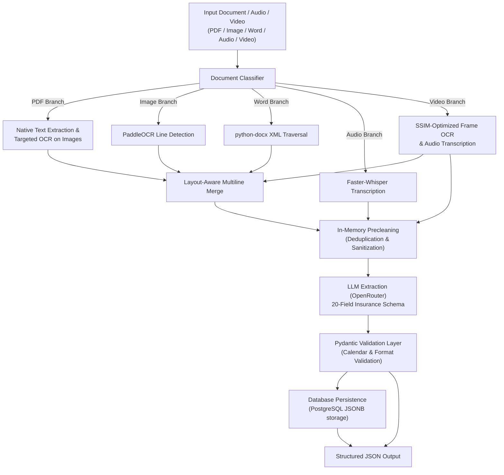

# Insurance Document Processor: System Understanding

This document provides a simple, detailed explanation of how the Insurance Document Processor works under the hood. It follows the simplified Mermaid architecture flow and explains every stage in detail. If anyone asks how this system functions or handles edge cases, they should find the answer here.

---

## 1. High-Level Flow Overview

The system takes an insurance document or audio recording (like a PDF, PNG image, Word document, or audio file) and transforms it into a structured, validated 20-field JSON output containing key policy data (e.g., insured name, cover start date, premium, payment method, etc.).

Here is the flow chart showing the journey of a file through the system:




---

## 2. Detailed Stage-by-Stage Explanation

### Step 1: Input Document & Classification
* **What happens**: The system accepts an uploaded document, audio file, or file path. The **Document Classifier** examines the file extension (case-insensitively) to route the file down the correct processing branch.
* **Q&A - Supported formats**: 
  * **Images**: `.png`, `.jpg`, `.jpeg`, `.tiff`, `.bmp`, `.webp`
  * **PDF**: `.pdf`
  * **Word**: `.docx`, and `.doc` (on Windows systems with Microsoft Word installed)
  * **Audio**: `.mp3`, `.wav`, `.m4a`, `.aac`, `.flac`
  * **Video**: `.mp4`, `.mov`, `.avi`, `.mkv`, `.webm`
* **Q&A - Unsupported extensions**: Raises a `ValueError` immediately.

---

### Step 2: Processing Branches (Text Extraction)
To extract the raw text blocks and coordinates, the system runs one of four specialized branches:

#### A. PDF Branch (Using PyMuPDF & PaddleOCR)
The PDF parser ([pipeline.py](file:///d:/ppoc/backend/pipeline.py)) iterates page by page through the document:
1. **Document Open**: PyMuPDF opens the file stream via `doc = fitz.open(file_path)`.
2. **Page Iteration**: It runs a loop over all page indices: `for page_num in range(len(doc)):` where `page = doc[page_num]`.
3. **Native Text Extraction**: For each page, it extracts vector font characters already stored in the document using `blocks = page.get_text("blocks")`. It filters for blocks containing actual text (block type `0`), preserving the text content, bounding boxes `[x0, y0, x1, y1]` in page points (1/72 inch), and sets confidence to `1.0`.
4. **Image Object Detection**: It calls `page.get_image_info()` to obtain a list of bounding boxes for all raster image drawings (like scanned logos, stamps, signatures, or background scans).
5. **Conditional OCR Decision**:
   * If the page contains a substantial amount of embedded native text (defined as $\ge 50$ characters), the script skips image region OCR to avoid slow processing times.
   * If the page contains $< 50$ characters (indicating a scanned PDF page), or if `force_ocr=True` is passed, it proceeds to run OCR on the detected image regions.
6. **Targeted Crop and OCR**: For each image bounding box:
   * It clips/crops that specific bounding box from the page using:
     ```python
     pix = page.get_pixmap(clip=rect, dpi=150)
     ```
   * It converts the cropped image bytes to a numpy array and passes it to the `PaddleOCR.predict(img_np)` model.
7. **Coordinate Mapping (Scale & Shift)**:
   PaddleOCR returns coordinates in pixel units relative to the cropped image. To map these back to the original PDF page space (points), the pipeline divides by the render scale factor and shifts by the cropped image's top-left origin `(rx0, ry0)` on the page:
   $$\text{scale} = \frac{\text{DPI}}{72.0} = \frac{150}{72.0} = 2.0833$$
   $$x_{\text{page}} = x_{\text{origin\_on\_page}} + \frac{x_{\text{pixel\_in\_crop}}}{\text{scale}}$$
   $$y_{\text{page}} = y_{\text{origin\_on\_page}} + \frac{y_{\text{pixel\_in\_crop}}}{\text{scale}}$$

#### B. Image Branch
* **How it works**: Standalone images are opened with `PIL.Image`, converted into a numpy array, and fed directly into the **PaddleOCR** line detection engine. PaddleOCR identifies text lines, reads the words, and returns bounding box coordinates.

#### C. Word Branch
* **How it works**: 
  * `.doc` files are first converted to `.docx` via Windows COM automation (using `pywin32` and MS Word).
  * `.docx` files are parsed recursively with `python-docx` traversing paragraphs, tables, and nested cells in document order.
  * Since Word documents don't have absolute physical coordinates like PDFs or Images, the system simulates a standard Letter-size coordinate space (`612 x 792` points) and sets all coordinates (`bbox`) to `[0.0, 0.0, 0.0, 0.0]`.

#### D. Audio Branch (Using Faster-Whisper)
* **How it works**: 
  * Audio recordings are decoded and preprocessed to 16kHz mono using `faster_whisper.audio.decode_audio`.
  * The system transcribes the speech to text using Faster-Whisper Small (supporting lazy model loading on CPU/GPU).
  * Timestamps are preserved in the `metadata` dictionary (as `start_time` and `end_time`).
  * To support chronological sorting, the `bbox` coordinates are set as `[start_time, 0.0, end_time, 0.0]`. The sorting algorithm in `precleaning.py` naturally puts them in order of start time since y-coordinates are all identical.

#### E. Video Branch (Using OpenCV, PyAV, Google Cloud Vision OCR, and Faster-Whisper)
* **How it works**:
  * Ingests common video files (`.mp4`, `.mov`, `.avi`, `.mkv`, `.webm`) and exposes three processing modes: frames, audio, and both.
  * **Frames Mode**: Extracts one frame every 2 seconds. Calculates the Structural Similarity Index (SSIM) score between the current frame and the previous frame to optimize processing:
    - **SSIM < 0.85 (Slide Change)**: Triggers Google Vision OCR on the frame.
    - **SSIM > 0.90 (Identical)**: Skips OCR entirely to save API costs and compute.
    - **0.85 <= SSIM <= 0.90 (Fuzzy Zone)**: Runs OCR on the frame, then compares the extracted text against the previous kept frame using `RapidFuzz`. If similarity $> 95.0\%$, the results are discarded.
    - OCR coordinates are mapped with time base offset: `y0 + timestamp * 10000.0` so that frames sort chronologically.
  * **Audio Mode**: Extracts the audio track using PyAV, converts to mono 16kHz, transcribes with Faster-Whisper, and maps the timeline offsets.
  * **Both Mode**: Runs both frame OCR and audio transcription concurrently in parallel using a `ThreadPoolExecutor`, merging the outputs chronologically.

---

### Step 3: Layout-Aware Multiline Merge
* **What happens**: OCR engines often slice a single address block or paragraph into multiple fragmented horizontal slices. The **Multiline Merge** algorithm (`merge_multiline_ocr`) takes these pieces and reconstructs them into cohesive text blocks.
* **Q&A - How does it merge without mixing columns?**:
  * It calculates the vertical distance between lines (must be close to typical line height).
  * It checks horizontal alignment (lines must start at similar horizontal alignment or align with the detected label columns).
  * It checks capitalization/casing consistency.
  * It verifies if there is an "intervening label" (e.g., if a different label like "Date of Birth" sits between two text lines, it refuses to merge them).

---

### Step 4: In-Memory Precleaning
* **What happens**: The raw extraction dict is sanitized using a **six-stage precleaning pipeline** to remove noise and resolve overlapping reads:
  1. **Confidence Tiering**: Grades blocks into High, Medium, or Low confidence.
  2. **Garbage/Signature Detection**: Detects stray character noise (e.g., `-`, `|`, `.`) and handwriting/signature scribbles (blocks that are disproportionately tall compared to the page's typical line height and have low confidence) and flags them.
  3. **Text Normalization**: 
     * Uses `ftfy` (fixes encoding errors/mojibake, smart quotes, and dashes).
     * Collapses excessive whitespace.
     * Collapses repeated trailing punctuation.
     * Uses **RapidFuzz** to correct minor OCR misreads against a custom insurance domain dictionary (e.g., correcting visual OCR typos like `"Mutral"` to `"Mutual"`).
  4. **Date Normalization**: Standardizes all date separators (dashes, dots, slashes) to `/` (e.g., `01-12-2024` -> `01/12/2024`).
  5. **Deduplication**: Resolves duplicate reads. If a block was extracted twice—once via native PDF text and once via image OCR—the system detects the overlap (by spatial overlap IoU > 0.5 AND text similarity > 80) and discards the OCR copy in favor of the native embedded text.
  6. **Reading Order Sorting**: Sorts text blocks top-to-bottom, left-to-right to ensure logical reading flow before sending to the LLM.

---

### Step 5: LLM Extraction (OpenRouter)
* **What happens**: The cleaned page texts are combined into a structured prompt, loading the instructions from [prompts.yaml](file:///d:/ppoc/backend/prompts.yaml). This prompt is sent to a large language model (defaulting to Gemma 4 via the **OpenRouter** API).
* **Q&A - What does the LLM extract?**: Exactly 20 fields as a raw JSON object.
* **Q&A - How does it handle missing fields?**: The prompt explicitly commands the model to return `""` (empty string) if a field is not found. It is instructed **not to infer, guess, or hallucinate** values.
* **Q&A - What happens during API rate-limiting (HTTP 429)?**: If the free model `google/gemma-4-31b-it:free` returns a 429 error, the script automatically retries using the paid variant `google/gemma-4-31b-it`.

---

### Step 6: Pydantic Validation Layer
* **What happens**: The raw JSON output from the LLM is validated against a strict Pydantic v2 schema in [extraction_schema.py](file:///d:/ppoc/backend/extraction_schema.py).
* **Q&A - What does it validate?**:
  * **Phone Numbers**: Must be 10-11 digits (non-numeric characters and country codes are removed; if invalid, coerced to `""`).
  * **Dates**: Enforces `DD/MM/YYYY` format and performs a calendar check (e.g. catches shape-valid-but-impossible dates like `31/02/2020` and coerces them to `""`).
  * **Email**: Permissive shape check; checks if visual email block is missing an `@` due to OCR error, keeping it but flagging it in metadata.
  * **Policy Number & Premium**: Validates regex formats.
  * **Required Fields**: `insurer_name` and `intermediary_name` are business-critical and require at least 1 character (`min_length=1`). If they are missing, validation raises a hard error. All other formatting errors "soft-fail" to `""` per policy instructions.
* **Q&A - What is `_extraction_meta`?**: A metadata block attached to the output JSON to communicate confidence:
  * `policy_status_defaulted`: True if `policy_status` was defaulted to `"Active"` because no status label was found in the text.
  * `policy_status_unrecognized`: True if policy status was found in text but didn't match the known enum (`Active`, `Cancelled`, `Lapsed`, etc.), keeping the raw status while signaling a warning.
  * `email_missing_at_symbol`: True if email is missing `@` but looks email-shaped.
  * `fields_not_found` & `fields_uncertain`: Lists of fields that were absent or resolved from positional matches.

---

## 3. Core Files and Their Responsibilities

The system consists of five key Python modules that act as a pipeline. Each file has a clear responsibility:

```
                  ┌──────────────────────┐
                  │      server.py       │ (Hosts FastAPI web server & upload route)
                  └──────────┬───────────┘
                             │ (Calls)
                             ▼
                  ┌──────────────────────┐
                  │   llm_extractor.py   │ (Orchestrator: runs pipeline -> clean -> LLM)
                  └──────────┬───────────┘
                             │ (Sequentially coordinates)
         ┌───────────────────┴───────────────────┐
         ▼                                       ▼
┌──────────────────┐                    ┌──────────────────┐
│   pipeline.py    │                    │  precleaning.py  │
│ (Reads documents │                    │ (Cleans raw text │
│  extracts layout │                    │  deduplicates    │
│  & text blocks)  │                    │  normalizes values)
└────────┬─────────┘                    └────────┬─────────┘
         │ (Returns raw dict)                    │ (Returns cleaned dict)
         └───────────────────┬───────────────────┘
                             │
                             ▼
                  ┌──────────────────────┐
                  │ llm_extractor.py (LLM)│ (Sends clean text to OpenRouter API)
                  └──────────┬───────────┘
                             │ (Returns raw JSON dict)
                             ▼
                  ┌──────────────────────┐
                  │ extraction_schema.py │ (Pydantic validation layer: formats & defaults)
                  └──────────────────────┘
```

### A. [pipeline.py](file:///d:/ppoc/backend/pipeline.py) (The Document Extractor)
* **Purpose**: Performs structural reading and layout analysis of input documents.
* **Input**: Absolute file path string pointing to a document.
* **Output**: A raw Python **dictionary** (`dict`) containing document metadata and structured blocks (bounding boxes, sources, text strings).
* **Next Destination**: Handed directly to `precleaning.py`.

### B. [precleaning.py](file:///d:/ppoc/backend/precleaning.py) (The Data Cleaner)
* **Purpose**: Deduplicates, normalizes, and filters the text blocks to prepare clean, read-order text.
* **Input**: The raw Python **dictionary** (`dict`) output by `pipeline.py`.
* **Output**: A modified, cleaned Python **dictionary** (`dict`) conforming to the same schema but containing sanitized text (with unicode repairs, typos resolved, dates unified, duplicates dropped, and sorted blocks).
* **Next Destination**: Returned to `llm_extractor.py`.

### C. [llm_extractor.py](file:///d:/ppoc/backend/llm_extractor.py) (The Pipeline Orchestrator & LLM Client)
* **Purpose**: Acts as the central director. It runs `pipeline.py` and `precleaning.py`, joins the sorted cleaned text blocks into a single string stream, sends the request to the AI, and receives the structured fields.
* **Input**: Absolute file path string.
* **Output**: A raw, parsed Python **dictionary** (`dict`) containing the 20 extracted fields from the document.
* **Next Destination**: Handed to `extraction_schema.py`.

### D. [extraction_schema.py](file:///d:/ppoc/backend/extraction_schema.py) (The Validation Layer)
* **Purpose**: Validates format rules (dates, emails, phone numbers) and injects diagnostic metadata.
* **Input**: The raw parsed dictionary output from `llm_extractor.py`.
* **Output**: A verified `PolicyExtraction` Pydantic model object (which can be exported to clean JSON).
* **Next Destination**: Returned as the final endpoint response.

### E. [server.py](file:///d:/ppoc/backend/server.py) (The Web Service API)
* **Purpose**: Exposes the pipeline over HTTP for the frontend React application.
* **Input**: Multipart file upload via an HTTP POST request to `/api/process`.
* **Output**: Final structured and validated JSON HTTP response containing all extracted fields and validation metadata.

---

## 4. How the Dictionary is Produced and Passed (Simple Analogy)

Think of the system as a **four-runner relay race** where the baton being passed is a Python **dictionary** containing the document data:

1. **Runner 1: The Reader (`pipeline.py`)**
   * *What it does*: Runner 1 picks up the raw document (like a PDF). It scans the pages, finds all text rows, measures their exact coordinates on the page, and constructs the baton (a Python dictionary structure containing lists of text boxes, coordinates, and labels).
   * *The Hand-off*: It hands this raw dictionary directly to Runner 2 in memory.

2. **Runner 2: The Cleaner (`precleaning.py`)**
   * *What it does*: Runner 2 receives the dictionary. It looks closely at each text box inside it. If it spots handwriting scribbles, it throws them away. If it finds the same label extracted twice, it drops the duplicate. It repairs encoding bugs and spellchecks the text, modifying the dictionary in place.
   * *The Hand-off*: It returns the sanitized dictionary back to the coach (`llm_extractor.py`).

3. **Runner 3: The Translator (`llm_extractor.py`)**
   * *What it does*: The coach reads the clean dictionary blocks from top-to-bottom, left-to-right, and concatenates all text into one continuous read string. It packages this string into an API envelope and sends it to the AI model (OpenRouter). The AI reads the document text and translates it into a new raw dictionary containing exactly 20 structured fields.
   * *The Hand-off*: It hands this AI dictionary to Runner 4.

4. **Runner 4: The Judge (`extraction_schema.py`)**
   * *What it does*: Runner 4 reviews the AI's dictionary. It checks if the dates are valid calendar dates and formats the phone numbers into clean digits. It appends a metadata check (`_extraction_meta`) to verify which fields were trusted or defaulted.
   * *The Hand-off*: The judge prints the final, validated JSON block. This is what the user sees on their screen!

---

## 5. Data Linking, Formats, and Schema Examples

Below is an example of the exact data transformations as a document passes from step to step:

### A. Raw Pipeline Output (from `pipeline.py` run in memory)
This is the structure of the Python dictionary returned by the `pipeline.py` branch. Both embedded text (from PDF fonts) and OCR text (from cropped image regions) coexist:

```json
{
  "document_id": "89b5a03b-d5d1-447c-ae08-410a562efb68",
  "document_name": "16.png",
  "document_type": "image",
  "total_pages": 1,
  "processing_time_ms": 2854.21,
  "pages": [
    {
      "page_number": 1,
      "width": 612.0,
      "height": 792.0,
      "text_sources": [
        {
          "source": "ocr",
          "text": "OLD MUTUAL INSURE LTD",
          "bbox": [50.0, 100.0, 300.0, 120.0],
          "confidence": 0.99,
          "metadata": {
            "bbox": [50.0, 100.0, 300.0, 120.0]
          }
        },
        {
          "source": "ocr",
          "text": "Policy Number: MUF-RIS0404-M-0072282",
          "bbox": [50.0, 140.0, 450.0, 160.0],
          "confidence": 0.98,
          "metadata": {
            "bbox": [50.0, 140.0, 450.0, 160.0]
          }
        }
      ]
    }
  ]
}
```

### A.1. Audio Pipeline Output (from `pipeline.py` run in memory)
This is the structure of the Python dictionary returned by the `pipeline.py` audio branch, which contains transcription segments with timestamps and audio metadata:

```json
{
  "document_id": "90c6a14b-d5d1-447c-ae08-410a562efb68",
  "document_name": "call_recording.mp3",
  "document_type": "audio",
  "total_pages": 1,
  "processing_time_ms": 1245.50,
  "pages": [
    {
      "page_number": 1,
      "width": 0.0,
      "height": 0.0,
      "text_sources": [
        {
          "source": "audio",
          "text": "Hello, thank you for calling Old Mutual Insure. My name is Payal.",
          "bbox": [0.5, 0.0, 4.2, 0.0],
          "confidence": 0.98,
          "metadata": {
            "start_time": 0.5,
            "end_time": 4.2
          }
        }
      ],
      "transcription_duration_ms": 1245.50
    }
  ]
}
```

### B. Cleaned Pipeline Output (from `precleaning.py`)
This dictionary is the result of running `DocumentCleaner.clean(raw_result)`. Note that overlapping blocks have been deduplicated, text normalized, and dictionary correction applied. The structure remains identical, but is augmented with `cleaning_metadata`:

```json
{
  "document_id": "89b5a03b-d5d1-447c-ae08-410a562efb68",
  "document_name": "16.png",
  "document_type": "image",
  "total_pages": 1,
  "processing_time_ms": 2854.21,
  "pages": [
    {
      "page_number": 1,
      "width": 612.0,
      "height": 792.0,
      "text_sources": [
        {
          "source": "ocr",
          "text": "OLD MUTUAL INSURE LTD",
          "bbox": [50.0, 100.0, 300.0, 120.0],
          "confidence": 0.99,
          "metadata": {
            "bbox": [50.0, 100.0, 300.0, 120.0]
          }
        },
        {
          "source": "ocr",
          "text": "Policy Number: MUF-RIS0404-M-0072282",
          "bbox": [50.0, 140.0, 450.0, 160.0],
          "confidence": 0.98,
          "metadata": {
            "bbox": [50.0, 140.0, 450.0, 160.0]
          }
        }
      ]
    }
  ],
  "cleaning_metadata": {
    "total_blocks_before": 2,
    "total_blocks_after": 2,
    "cleaning_duration_ms": 7.18
  }
}
```

### C. Reconstructed Text Stream (inside `llm_extractor.py`)
The list of normalized text blocks is joined into a plain string formatted page by page. This string forms the context sent to the LLM:

```text
--- PAGE 1 ---
OLD MUTUAL INSURE LTD
Policy Number: MUF-RIS0404-M-0072282
```

### D. OpenRouter API Request Payload
The formatted text is inserted into the template in `prompts.yaml` and sent as an HTTP POST request:

* **Endpoint**: `https://openrouter.ai/api/v1/chat/completions`
* **Headers**:
  ```json
  {
    "Authorization": "Bearer sk-or-v1-...",
    "Content-Type": "application/json",
    "HTTP-Referer": "https://github.com/atharv-suryavanshi06/Insurance-Document-Processor",
    "X-Title": "Insurance Document Processor"
  }
  ```
* **Payload**:
  ```json
  {
    "model": "google/gemma-4-31b-it:free",
    "messages": [
      {
        "role": "system",
        "content": "You are a precise data extraction agent. Extract structured information from the provided document text as a valid JSON object. Return ONLY the raw JSON block without markdown packaging, preamble, or any conversational text."
      },
      {
        "role": "user",
        "content": "INSURANCE POLICY EXTRACTION PROMPT\n\nExtract these 20 fields...\n\nDOCUMENT TEXT TO EXTRACT FROM:\n--- PAGE 1 ---\nOLD MUTUAL INSURE LTD\nPolicy Number: MUF-RIS0404-M-0072282"
      }
    ],
    "temperature": 0.1,
    "response_format": {"type": "json_object"}
  }
  ```

### E. Pydantic Validation & Final Output (from `extraction_schema.py`)
After parsing the LLM response, the raw fields are validated and packaged with `_extraction_meta` by Pydantic:

```json
{
  "insured_name": "PAYP TRADING AND PROJECTS (PTY) LTD",
  "date_of_birth": "",
  "occupation": "",
  "postal_address": "",
  "physical_address": "21 Hadeda Crescent HINJEWADI PUNE 0286",
  "cell_phone": "0718127925",
  "email": "yusdhchsding@tomail.com",
  "policy_number_broker": "MUF-RIS0404-M-0072282",
  "policy_type": "OMI - MULTISURE 2024.4",
  "policy_status": "Active",
  "start_date_of_cover": "",
  "anniversary_date": "",
  "original_inception_date": "06/04/2022",
  "period_of_insurance": "(A) 08/11/2024 to 30/11/2024, and renewing monthly thereafter.",
  "total_premium": "",
  "payment_method": "Debit Order",
  "co_insured_name": "",
  "insurer_name": "OLD MUTUAL INSURE LTD",
  "insurer_phone": "",
  "intermediary_name": "RISK INSURE BROKERS",
  "_extraction_meta": {
    "policy_status_defaulted": true,
    "policy_status_unrecognized": false,
    "email_missing_at_symbol": false,
    "fields_not_found": [],
    "fields_uncertain": []
  }
}
```

### F. Database Persistence (from `db.py`)
After Pydantic validation completes, the orchestrator invokes the database layer to store the results:
* **Connection Pooling**: Managed via `SimpleConnectionPool` on startup.
* **Unified Database Table**: Inserts the validated result dictionary into the `processed_documents` table in PostgreSQL. The metadata companion (`_extraction_meta`) is extracted and saved into a separate `meta_data` JSONB column, while the rest of the fields go to `extracted_data`.
* **GIN Indexes**: Allows rapid and queryable access to any field inside the JSON structure without requiring schema-specific database migrations.

---

## 6. Frequently Asked Questions (FAQ)

#### Q: When running the script, why don't I see any output JSON files stored in the `output/` folder?
A: 
* When running the end-to-end pipeline using `llm_extractor.py` (or through the web server `server.py`), **all data passing and extraction happen in-memory** and are saved directly into the **PostgreSQL database**. No intermediate files are saved to the disk.
* File output to the `output/` folder only occurs when you run the extraction pipeline standalone:
  ```powershell
  python backend/pipeline.py data/16.png --output-dir output
  ```


#### Q: How does the system handle temporary uploads in the web server?
A: In `server.py`, uploaded files are temporarily written to a subfolder named `uploads/` with a random hex string name to prevent file collisions. When processing finishes (or errors out), a `finally` block guarantees that the file is deleted from the server disk.

#### Q: Where is the LLM API key and model config stored?
A: In a `.env` file in the project root directory. The hand-rolled environment loader dynamically searches for it in the running directory, script directory, and parent folders.

#### Q: How are dependencies isolated?
A: The backend dependencies are defined in [requirements.txt](file:///d:/ppoc/backend/requirements.txt), and the frontend dependencies are defined in `frontend/package.json`.

#### Q: Why is `sys.path` modified in `server.py`?
A: Because python scripts are moved inside the `backend/` folder, importing sibling files could fail if they are executed from the root folder. Modifying `sys.path` at the entry point guarantees that imports like `from llm_extractor import ...` resolve cleanly.
